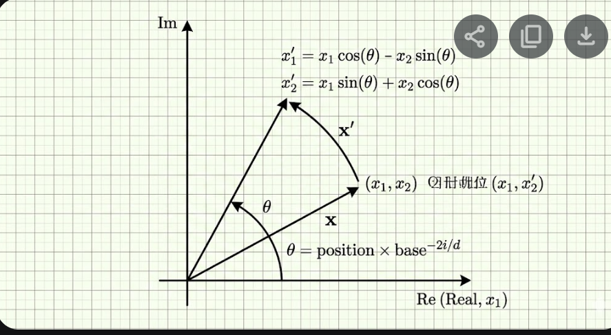

# CS336 Assignment 1: Basics - 学习计划

> **目标**: 从零构建 LLM 的所有基础组件 —— Tokenizer、Transformer 架构、训练循环

---

## 📋 Assignment 1 任务概览

| 模块 | 任务描述 | 难度 | vLLM 对应概念 |
|------|---------|------|--------------|
| **BPE Tokenizer** | 实现 Byte-Pair Encoding 分词器训练和推理 | ⭐⭐⭐ | 模型输入预处理 |
| **Softmax** | 实现数值稳定的 softmax | ⭐ | 注意力计算基础 |
| **SiLU** | 实现 SiLU 激活函数 | ⭐ | FFN 激活函数 |
| **RMSNorm** | 实现 Root Mean Square Normalization | ⭐⭐ | Llama/Qwen 模型的 LayerNorm |
| **RoPE** | 实现 Rotary Positional Embedding | ⭐⭐⭐ | 现代 LLM 的位置编码 |
| **Linear** | 实现无 bias 线性层 | ⭐ | 模型的基础构建块 |
| **Embedding** | 实现查表式嵌入层 | ⭐ | Token → 向量映射 |
| **SwiGLU** | 实现 SwiGLU 前馈网络 | ⭐⭐ | 现代 FFN (Llama/Qwen) |
| **Scaled Dot-Product Attention** | 实现注意力机制 | ⭐⭐ | FlashAttention 的前身 |
| **Multi-Head Self-Attention** | 实现多头注意力 (含 RoPE) | ⭐⭐⭐ | vLLM 核心计算 |
| **Transformer Block** | 组装 Pre-Norm Transformer 层 | ⭐⭐ | 模型的一层 |
| **Transformer LM** | 组装完整语言模型 | ⭐⭐ | 端到端模型 |
| **Cross-Entropy Loss** | 实现交叉熵损失函数 | ⭐⭐ | 训练目标 |
| **AdamW Optimizer** | 实现 AdamW 优化器 | ⭐⭐⭐ | 训练核心 |
| **Cosine LR Schedule** | 实现余弦学习率衰减 + warmup | ⭐⭐ | 训练超参数 |
| **Gradient Clipping** | 实现梯度裁剪 | ⭐ | 训练稳定性 |
| **Checkpoint Save/Load** | 模型序列化/反序列化 | ⭐⭐ | vLLM 加载模型权重 |
| **数据加载 (get_batch)** | 实现数据批次采样 | ⭐⭐ | 训练数据流 |

---

## 🎯 学习路径

### Phase 1: 基础数学组件 (2小时)

？ **PyTorch 把 `Linear` 的权重存成：**

```
(out_features, in_features)
```

而不是：

```
(in_features, out_features)
```

主要是因为：

> 👉 **这样更符合“每一行 = 一个神经元”的直觉 + 更利于底层高性能计算 + 符合数学传统。**

所以算的时候才写：

```
x @ W.T
```

而不是 `x @ W`。

**实现**: `softmax`, `silu`, `cross_entropy`, `rmsnorm`

```python
# Softmax — 数值稳定版本
def softmax(x, dim=-1):
    x_max = x.max(dim=dim, keepdim=True).values
    x_exp = torch.exp(x - x_max)  # 减去最大值防止溢出
    return x_exp / x_exp.sum(dim=dim, keepdim=True)

# RMSNorm — Llama/Qwen 使用的归一化
class RMSNorm(nn.Module):
    def forward(self, x):
        rms = torch.rsqrt(x.pow(2).mean(-1, keepdim=True) + self.eps)
        return self.weight * (x * rms)

# SiLU — 又名 Swish 激活函数  
def silu(x):
    return x * torch.sigmoid(x)

# Cross Entropy Loss with Derivation
def cross_entropy(logits, targets):
    # nll = - log P(target)
    # P(target) = exp(x_target) / sum(exp(x_j))
    # log P(target) = x_target - log(sum(exp(x_j))) = x_target - LogSumExp(x)
    # Loss = - (x_target - LogSumExp(x))
    
    log_z = torch.logsumexp(logits, dim=-1)
    target_logits = logits[range(len(logits)), targets]
    loss = - (target_logits - log_z)
    return loss.mean()
```

**Cross Entropy 详细推导**:

**一、从「概率」开始**
分类模型最后一层输出的是 logits $z = [z_1, z_2, ..., z_V]$。它们不是概率，只是“分数”。
我们要先变成概率 → 用 Softmax：
$$ p_j = \frac{e^{z_j}}{\sum_k e^{z_k}} $$

(应该是第 $j$ 类的预测概率)

**二、交叉熵的原始定义**
真实标签是 one-hot。比如第 $i$ 个样本真实类别是 $y$: `[0, 0, 1, 0, 0]`。
交叉熵定义是：
$$ L = -\sum_j y_j \log(p_j) $$
其中 $y_j$ 只有正确类是 1，其他都是 0。
所以其实：
$$ L = -\log(p_y) $$
👉 只看正确类别的概率。

**三、代入 Softmax**
刚才：$p_y = \frac{e^{z_y}}{\sum_j e^{z_j}}$
带进去：
$$ L = -\log \left( \frac{e^{z_y}}{\sum_j e^{z_j}} \right) $$

**四、拆 Log（关键一步）**
用对数公式 $\log \frac{a}{b} = \log a - \log b$：
$$ L = - (\log e^{z_y} - \log \sum_j e^{z_j}) $$
又因为 $\log e^x = x$，变成：
$$ L = - (z_y - \log \sum_j e^{z_j}) $$

**五、加上 Batch 维度**
对第 $i$ 个样本：
$$ L_i = -(z_{i, y_i} - \log \sum_j e^{z_{i, j}}) $$
这就是代码中 `loss = - (target_logits - log_z)` 的数学来源。这个公式更加数值稳定，不需要显式计算 `exp(x)` 再除法。

**💡 与 vLLM 对照**: 
- vLLM 中的 RMSNorm: `vllm/model_executor/layers/layernorm.py`
- Qwen3 模型使用 RMSNorm + SwiGLU 正是这里学到的组合

---

### Phase 2: 位置编码 RoPE (2小时)

**RoPE (Rotary Positional Embedding)** 是现代 LLM 的标配位置编码。

```
核心思想:
┌──────────────────────────────────────────┐
│  将位置信息编码为旋转操作                  │
│  对 query/key 向量对施加 2D 旋转          │
│                                          │
│  x = [x₁, x₂, x₃, x₄, ...]            │
│  配对: (x₁,x₂), (x₃,x₄), ...           │
│  每对做旋转:                              │
│    x₁' = x₁·cos(θ) - x₂·sin(θ)         │
│    x₂' = x₁·sin(θ) + x₂·cos(θ)         │
│  θ = position × base^(-2i/d)            │
└──────────────────────────────────────────┘
```

**💡 与 vLLM 对照**:

- `vllm/model_executor/layers/rotary_embedding.py`

- Qwen3 中 RoPE 的调用: `Qwen3RotaryEmbedding`

- 

- 这正是标准的 **2D 旋转矩阵**乘法展开形式：

  $$  \begin{pmatrix} x_1' \\ x_2' \end{pmatrix} = \begin{pmatrix} \cos\theta & -\sin\theta \\ \sin\theta & \cos\theta \end{pmatrix} \begin{pmatrix} x_1 \\ x_2 \end{pmatrix}$$

---

### Phase 3: 注意力机制 (3小时)

**从 Scaled Dot-Product → Multi-Head Self-Attention**

```
Scaled Dot-Product Attention:
  Attention(Q,K,V) = softmax(QK^T / √d_k) · V

Multi-Head Attention:
  1. 线性投影 Q,K,V 到 num_heads 个子空间
  2. 每个 head 独立计算 attention
  3. concat 所有 head 的输出
  4. 最终线性投影

SwiGLU FFN:
  SwiGLU(x) = (SiLU(xW₁) ⊙ xW₃) · W₂
```

**💡 与 vLLM 对照**:
- `scaled_dot_product_attention` → 这正是 FlashAttention 要优化的计算
- 理解 Q/K/V 投影 → 理解 vLLM 中的 `QKVParallelLinear`
- 参考实现在 `cs336-basics/model.py` 中的 `CausalMultiHeadSelfAttention`

---

### Phase 4: 组装完整模型 (2小时)

```
BasicsTransformerLM
├── Embedding(vocab_size, d_model)           # Token 嵌入
├── RotaryEmbedding(context_length, d_head)  # RoPE
├── TransformerBlock × num_layers            # Pre-Norm Transformer
│   ├── RMSNorm(d_model)                     # 第一个 LayerNorm
│   ├── CausalMultiHeadSelfAttention         # 多头注意力
│   │   ├── q_proj: Linear(d_model, d_model)
│   │   ├── k_proj: Linear(d_model, d_model)
│   │   ├── v_proj: Linear(d_model, d_model)
│   │   ├── RoPE on Q and K
│   │   ├── Causal Mask
│   │   ├── scaled_dot_product_attention
│   │   └── output_proj: Linear(d_model, d_model)
│   ├── RMSNorm(d_model)                     # 第二个 LayerNorm
│   └── SwiGLU(d_model, d_ff)               # FFN
│       ├── w1: Linear(d_model, d_ff)
│       ├── w2: Linear(d_ff, d_model)
│       └── w3: Linear(d_model, d_ff)
├── RMSNorm(d_model)                         # 最终 LayerNorm
└── lm_head: Linear(d_model, vocab_size)     # 输出投影
```

---

### Phase 5: BPE Tokenizer (3小时)

**BPE (Byte-Pair Encoding)** 分词器：

```
训练算法:
1. 初始化 vocab 为所有单字节 (256个)
2. 重复直到 vocab_size:
   a. 找到语料中最频繁的相邻 token 对
   b. 合并该 token 对为新 token
   c. 加入 vocab
   
推理算法 (Encode):
1. 将文本拆分为字节序列
2. 按照合并规则的优先级，反复合并相邻 token
3. 输出 token ID 序列

Decode:
- 将 token ID 映射回字节，拼接为文本
```

**💡 与 vLLM 对照**:
- vLLM 使用 HuggingFace tokenizer，但底层原理相同
- 理解 tokenizer 有助于理解 prompt 长度计算和 KV cache 大小

---

### Phase 6: 训练组件 (3小时)

**AdamW**, **Cosine Schedule**, **Gradient Clipping**, **Checkpoint**

```python
# AdamW 核心更新规则
m = β₁ * m + (1 - β₁) * grad           # 一阶动量
v = β₂ * v + (1 - β₂) * grad²          # 二阶动量
m_hat = m / (1 - β₁^t)                  # 偏差修正
v_hat = v / (1 - β₂^t)                  # 偏差修正
param = param - lr * (m_hat / (√v_hat + ε) + weight_decay * param)

# Cosine Schedule with Warmup
if t < T_warmup:
    lr = t / T_warmup * lr_max           # 线性 warmup
elif t < T_cosine:
    lr = lr_min + 0.5 * (lr_max - lr_min) * (1 + cos(π * (t - T_w) / (T_c - T_w)))
else:
    lr = lr_min                          # 保持最小学习率

# Gradient Clipping with Derivation
def gradient_clipping(parameters, max_l2_norm):
    # 1. 计算所有梯度拼接后的 L2 范数
    # total_norm = sqrt(sum(norm(p.grad)**2))
    total_norm = torch.norm(torch.stack([torch.norm(p.grad.detach(), 2) for p in parameters]), 2)
    
    # 2. 计算缩放系数 k
    # 目标: new_norm <= max_l2_norm (C)
    # 如果 total_norm (||g||) > C:
    #    scale = C / ||g||
    #    new_grad = g * scale
    #    验证: ||new_grad|| = ||g * (C/||g||)|| = ||g|| * (C/||g||) = C
    #
    # 如果 total_norm <= C:
    #    scale = 1.0 (不改变)
    
    clip_coef = max_l2_norm / (total_norm + 1e-6)
    clip_coef = torch.clamp(clip_coef, max=1.0)
    
    # 3. 原地更新梯度
    for p in parameters:
        p.grad.detach().mul_(clip_coef)
```

---

## 🔗 与 vLLM 的连接

| CS336 组件 | vLLM 位置 | 连接说明 |
|-----------|----------|---------|
| RMSNorm | `vllm/model_executor/layers/layernorm.py` | vLLM 使用融合版本 |
| RoPE | `vllm/model_executor/layers/rotary_embedding.py` | 支持多种 RoPE 变体 |
| MHA → GQA | `vllm/model_executor/layers/attention.py` | Assignment 1 是 MHA，vLLM 支持 GQA |
| SwiGLU | 模型实现中的 `gate_up_proj` | Qwen3/Llama 都使用 SwiGLU |
| Linear | `vllm/model_executor/layers/linear.py` | 支持 TP 切分的线性层 |
| Tokenizer | `vllm/transformers_utils/tokenizer.py` | 使用 HuggingFace tokenizer |

---

## 📚 配套讲座

1. **Lecture 1** (`spring2025-lectures/lecture_01.py`) — 语言模型基础
2. **Lecture 2** (`spring2025-lectures/lecture_02.py`) — 深入理解
3. **Lecture 3** (`nonexecutable/2025 Lecture 3 - architecture.pdf`) — 架构设计
4. **Lecture 4** (`nonexecutable/2025 Lecture 4 - MoEs.pdf`) — 混合专家模型

---

## 🧪 测试命令

```bash
cd D:\projects\vllm\cs336\assignment1-basics

# 安装依赖
uv sync

# 运行所有测试
uv run pytest tests/ -v

# 单独测试各模块
uv run pytest tests/test_nn_utils.py -v      # softmax, silu, cross_entropy
uv run pytest tests/test_model.py -v          # 模型组件
uv run pytest tests/test_tokenizer.py -v      # Tokenizer
uv run pytest tests/test_train_bpe.py -v      # BPE 训练
uv run pytest tests/test_optimizer.py -v      # AdamW
uv run pytest tests/test_data.py -v           # 数据加载
uv run pytest tests/test_serialization.py -v  # Checkpoint
```

---

## 📅 学习时间安排

| 阶段 | 预计时间 | 产出 |
|------|---------|------|
| Phase 1: 基础数学组件 | 2小时 | softmax, RMSNorm, SiLU, cross_entropy |
| Phase 2: RoPE | 2小时 | 旋转位置编码 |
| Phase 3: 注意力机制 | 3小时 | SDPA + Multi-Head Attention |
| Phase 4: 组装模型 | 2小时 | 完整 Transformer LM |
| Phase 5: BPE Tokenizer | 3小时 | 分词器训练和推理 |
| Phase 6: 训练组件 | 3小时 | AdamW, LR Schedule, Checkpoint |
| **对照 vLLM 源码** | 2小时 | 深入理解 |

**总计**: ~17小时

---

## ✅ 关键学习成果

完成 Assignment 1 后，您将理解：
- 🧩 **一个 LLM 的完整组成**: 从 tokenizer 到最终输出
- 🔧 **每个组件的数学原理**: RoPE、SwiGLU、RMSNorm 为什么这样设计
- 📊 **训练流程**: 数据加载 → 前向传播 → 损失计算 → 反向传播 → 参数更新
- 🔗 **与 vLLM 的联系**: 这些组件在生产推理系统中如何使用
