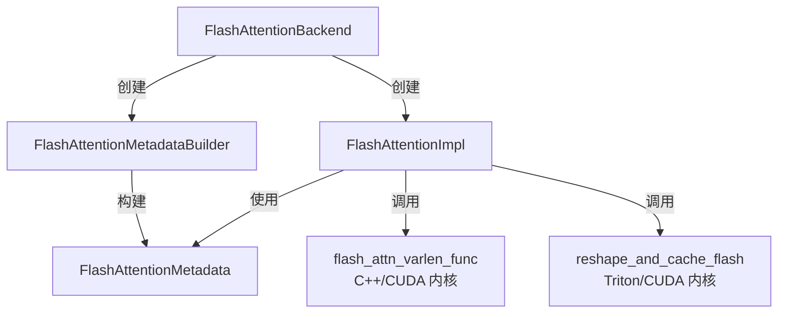
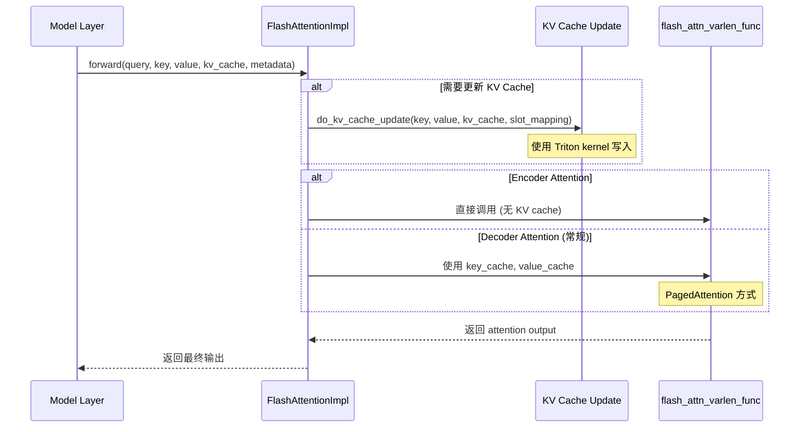

# vLLM Flash Attention 实现详解

## 一、核心目录结构

```
vllm/v1/attention/backends/
├── flash_attn.py              # Flash Attention 主实现
├── fa_utils.py                 # Flash Attention 工具函数
└── ops/
    └── triton_reshape_and_cache_flash.py  # KV Cache 写入的 Triton 实现
```

> [!NOTE]
> `vllm/vllm_flash_attn/` 目录当前为空（仅预留），真正的实现在 `v1/attention/backends/` 中。

---

## 二、架构概览

### 2.1 三层架构



**职责划分**:
- `FlashAttentionBackend`: 后端注册器 + 配置验证
- `FlashAttentionMetadataBuilder`: 构建每个 batch 的 attention 元数据
- `FlashAttentionImpl`: 核心前向传播逻辑

---

## 三、核心组件详解

### 3.1 FlashAttentionBackend (后端)

**位置**: [`flash_attn.py:58-183`](file:///c:/projects/vllm/vllm/v1/attention/backends/flash_attn.py#L58-L183)

#### 关键职责

1. **设备兼容性检查**
   ```python
   @classmethod
   def supports_compute_capability(cls, capability: DeviceCapability) -> bool:
       return capability >= DeviceCapability(8, 0)  # Ampere 架构及以上
   ```

2. **KV Cache 布局设计**
   ```python
   @staticmethod
   def get_kv_cache_shape(num_blocks, block_size, num_kv_heads, head_size, ...):
       # 返回: (2, num_blocks, block_size, num_kv_heads, head_size)
       #       ↑                ↑            ↑            ↑
       #      K/V           PagedAttention   每 Page     每个头
   ```

3. **版本选择策略** (FA2 vs FA3)
   - **FA3**: 用于 H100/H200 (SM_90)
   - **FA2**: 用于 A100/A6000 (SM_80/86)

---

### 3.2 FlashAttentionMetadataBuilder (元数据构建器)

**位置**: [`flash_attn.py:234-519`](file:///c:/projects/vllm/vllm/v1/attention/backends/flash_attn.py#L234-L519)

#### 核心数据结构: FlashAttentionMetadata

```python
@dataclass
class FlashAttentionMetadata:
    num_actual_tokens: int           # 去除 padding 后的实际 token 数
    max_query_len: int               # 当前 batch 最大 query 长度
    query_start_loc: torch.Tensor    # [num_seqs+1], 累加和数组，标记每个序列起始位置
    max_seq_len: int                 # 最大序列长度（包括 KV cache）
    seq_lens: torch.Tensor           # [num_seqs], 每个序列的 KV 长度
    block_table: torch.Tensor        # [num_seqs, max_blocks], PagedAttention 块表
    slot_mapping: torch.Tensor       # [num_tokens], 将 token 映射到 KV cache slot
    
    # Cascade Attention (实验性功能)
    use_cascade: bool
    common_prefix_len: int           # 共享前缀长度
    
    # FA3 AOT 调度元数据
    scheduler_metadata: torch.Tensor | None
```

#### 关键流程: `build()` 方法

```python
def build(self, common_prefix_len, common_attn_metadata, fast_build=False):
    # 1. 提取通用 metadata
    num_actual_tokens = common_attn_metadata.num_actual_tokens
    query_start_loc = common_attn_metadata.query_start_loc  # cu_seqlens
    
    # 2. FA3 AOT 调度 (提前优化 kernel 启动参数)
    if self.aot_schedule and not fast_build:
        scheduler_metadata = get_scheduler_metadata(
            batch_size=num_reqs,
            max_seqlen_q=max_query_len,
            max_seqlen_k=max_seq_len,
            num_heads_q=self.num_heads_q,
            num_heads_kv=self.num_heads_kv,
            ...
        )
    
    # 3. 返回元数据
    return FlashAttentionMetadata(...)
```

---

### 3.3 FlashAttentionImpl (核心实现)

**位置**: [`flash_attn.py:521-948`](file:///c:/projects/vllm/vllm/v1/attention/backends/flash_attn.py#L521-L948)

#### 前向传播流程



#### 关键代码段

```python
def forward(self, ..., query, key, value, kv_cache, attn_metadata, output):
    num_actual_tokens = attn_metadata.num_actual_tokens
    
    # 1. 处理 Encoder Attention (无 KV cache)
    if attn_type in (AttentionType.ENCODER_ONLY, AttentionType.ENCODER):
        return self._forward_encoder_attention(...)
    
    # 2. 解包 KV cache
    key_cache, value_cache = kv_cache.unbind(0)  # (2, ...) -> 两个 tensor
    
    # 3. FP8 量化支持
    if self.kv_cache_dtype.startswith("fp8"):
        dtype = FlashAttentionBackend.get_fp8_dtype_for_flashattn(...)
        key_cache = key_cache.view(dtype)
        value_cache = value_cache.view(dtype)
    
    # 4. 调用底层 Flash Attention kernel
    flash_attn_varlen_func(
        q=query[:num_actual_tokens],
        k=key_cache,                    # 直接使用 paged cache
        v=value_cache,
        out=output[:num_actual_tokens],
        cu_seqlens_q=attn_metadata.query_start_loc,  # 累加和数组
        max_seqlen_q=attn_metadata.max_query_len,
        seqused_k=attn_metadata.seq_lens,           # 每个序列的实际长度
        max_seqlen_k=attn_metadata.max_seq_len,
        softmax_scale=self.scale,                   # 1/sqrt(d_k)
        causal=attn_metadata.causal,
        block_table=attn_metadata.block_table,      # PagedAttention 映射
        scheduler_metadata=attn_metadata.scheduler_metadata,  # FA3 优化
        fa_version=self.vllm_flash_attn_version,
        ...
    )
    return output
```

---

## 四、KV Cache 更新机制

### 4.1 Triton Kernel 实现

**位置**: [`triton_reshape_and_cache_flash.py:10-111`](file:///c:/projects/vllm/vllm/v1/attention/ops/triton_reshape_and_cache_flash.py#L10-L111)

#### Kernel 流程

```python
@triton.jit
def reshape_and_cache_kernel_flash(
    key_ptr, value_ptr,         # 输入: [num_tokens, num_heads, head_size]
    key_cache_ptr, value_cache_ptr,  # 输出: [num_blocks, block_size, num_heads, head_size]
    slot_mapping_ptr,           # [num_tokens] -> KV cache slot 映射
    ...
):
    token_idx = tl.program_id(axis=0)
    slot_idx = tl.load(slot_mapping_ptr + token_idx).to(tl.int64)
    
    if slot_idx < 0:  # Padding token
        return
    
    # 1. 计算块索引和块内偏移
    block_idx = slot_idx // block_size
    block_offset = slot_idx % block_size
    
    # 2. 并行处理一个 tile (例如 2048 个元素)
    tile_i = tl.program_id(axis=1)
    tile_pos = tile_i * TILE_SIZE + tl.arange(0, TILE_SIZE)
    
    # 3. 加载 key/value
    key_load = tl.load(key_ptr + src_key_idx + tile_pos, ...)
    value_load = tl.load(value_ptr + src_value_idx + tile_pos, ...)
    
    # 4. FP8 量化 (如果启用)
    if FP8_KV_CACHE:
        key_tile = key_load / tl.load(k_scale)    # 动态量化
        value_tile = value_load / tl.load(v_scale)
    
    # 5. 写入 cache (支持两种布局)
    if USE_HEAD_MAJOR_LAYOUT:
        # Head-major: [Block, Head, Dim, Slot]
        tgt_idx = block_idx * block_stride + cur_head * head_stride + ...
    else:
        # Slot-major: [Block, Slot, Head, Dim]
        tgt_idx = block_idx * block_stride + block_offset * page_stride + tile_pos
    
    tl.store(key_cache_ptr + tgt_idx, key_tile, ...)
    tl.store(value_cache_ptr + tgt_idx, value_tile, ...)
```

#### Grid 配置

```python
grid = (
    slot_mapping.shape[0],          # X 轴: 每个 token 一个线程块
    triton.cdiv(n, TILE_SIZE),      # Y 轴: 按 tile 切分
)
```

---

## 五、特殊优化

### 5.1 Cascade Attention (级联注意力)

**场景**: 多个请求共享长前缀 (如系统提示词)

```python
if common_prefix_len > 256 and num_reqs >= 8:
    # 1. 对共享前缀单独计算 attention
    prefix_attn_out = flash_attn_varlen_func(
        q=all_queries,
        k=prefix_kv_cache[:common_prefix_len],
        ...
    )
    
    # 2. 对每个请求的独有后缀计算 attention
    suffix_attn_out = flash_attn_varlen_func(
        q=query_per_request,
        k=suffix_kv_cache[common_prefix_len:],
        ...
    )
    
    # 3. 合并两部分结果
    merge_attn_states(output, prefix_attn_out, suffix_attn_out, ...)
```

### 5.2 GQA DCP (Grouped-Query Attention with Data-parallel Computing)

**位置**: [`flash_attn.py:796-882`](file:///c:/projects/vllm/vllm/v1/attention/backends/flash_attn.py#L796-L882)

```python
def _forward_with_dcp(self, query, key, value, key_cache, value_cache, ...):
    # 1. AllGather query across DCP group
    query_across_dcp = get_dcp_group().all_gather(query, dim=1)
    
    # 2. 计算 context attention
    context_attn_out, context_lse = flash_attn_varlen_func(
        q=query_across_dcp,
        k=key_cache,
        seqused_k=attn_metadata.dcp_context_kv_lens,  # 本地 KV 长度
        ...
    )
    
    # 3. AllGather + ReduceScatter
    context_attn_out_cor = cp_lse_ag_out_rs(context_attn_out, context_lse, ...)
    
    # 4. 合并 context 和 query attention
    merge_attn_states(...)
```

---

## 六、版本差异总结

| 特性 | FA2 | FA3 |
|------|-----|-----|
| **支持 GPU** | Ampere+ (SM_80) | Hopper+ (SM_90) |
| **FP8 支持** | ❌ | ✅ |
| **Sink Tokens** | ❌ | ✅ (用于长上下文优化) |
| **AOT Scheduling** | ❌ | ✅ (提前优化 kernel 启动) |
| **CUDA Graph** | 部分支持 | 完整支持 |
| **MLA 支持** | ❌ | ✅ (Multi-head Latent Attention) |

---

## 七、调用链路示例

```python
# 完整流程
Model.forward()
  └─> Attention.forward()
        ├─> FlashAttentionImpl.do_kv_cache_update()
        │     └─> reshape_and_cache_flash()  # Triton kernel
        │           └─> reshape_and_cache_kernel_flash[grid]  # GPU 执行
        │
        └─> FlashAttentionImpl.forward()
              └─> flash_attn_varlen_func()  # C++/CUDA 调用
                    └─> vllm_flash_attn.so  # 底层 CUDA kernel
```

---

## 八、关键性能优化点

1. **内存布局优化**: 支持 Head-major 和 Slot-major 两种布局
2. **FP8 量化**: FA3 配合 H100 Tensor Core 加速
3. **AOT 调度**: FA3 提前计算最优 grid/block 配置
4. **CUDA Graph**: 减少 kernel 启动开销 (~10-20% 加速)
5. **Triton JIT**: KV cache 写入使用 Triton 而非手写 CUDA (易维护)

---

## 九、待进一步探索

- `vllm_flash_attn.so` 的 C++/CUDA 实现细节
- Cascade Attention 的性能阈值调优
- GQA DCP 的通信开销分析
