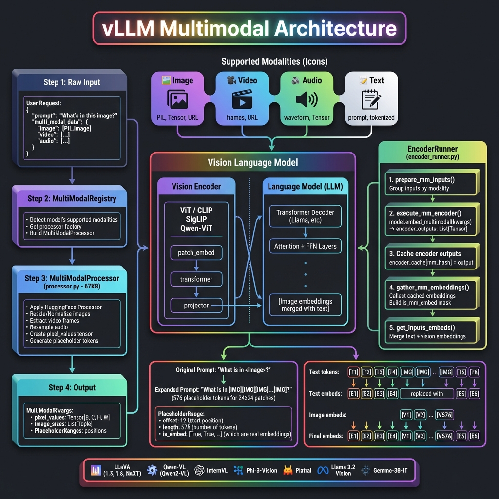
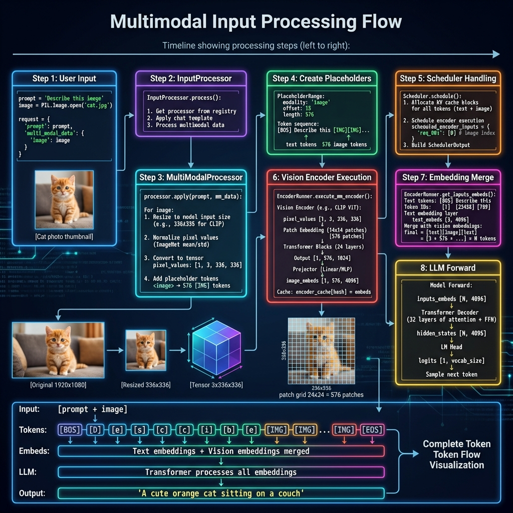
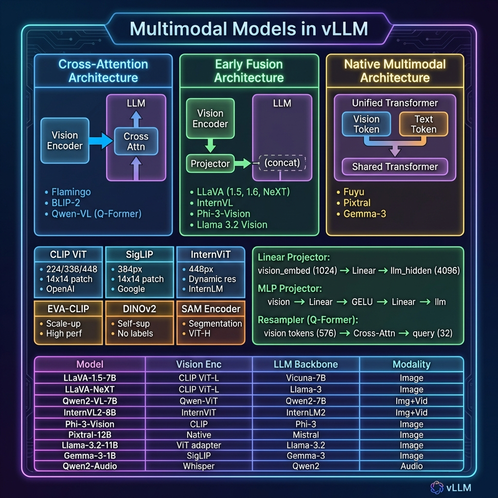

# vLLM 多模态架构深度解析

## 📋 概述

vLLM 支持多种视觉语言模型（VLM）和多模态大语言模型的高效推理。本文档详细介绍 vLLM 中多模态处理的架构设计、工作流程和实现细节。

---

## 🌈 支持的模态类型

| 模态 | 输入类型 | 处理方式 |
|------|----------|----------|
| 🖼️ **图像** | PIL.Image, Tensor, URL, Base64 | Vision Encoder + Projector |
| 🎥 **视频** | 帧序列, URL, 文件路径 | 逐帧处理或视频编码器 |
| 🔊 **音频** | 波形数组, Tensor, URL | Audio Encoder (Whisper等) |
| 📝 **文本** | 字符串, Token IDs | Tokenizer + Text Embedding |

---

## 🏗️ 整体架构



### 核心组件

| 组件 | 文件位置 | 功能 |
|------|----------|------|
| **MultiModalRegistry** | `vllm/multimodal/registry.py` | 模态注册和处理器分发 |
| **MultiModalProcessor** | `vllm/multimodal/processing/processor.py` | 多模态输入预处理 (67KB) |
| **EncoderRunner** | `vllm/v1/worker/gpu/mm/encoder_runner.py` | 视觉编码器执行 |
| **MultiModalInputs** | `vllm/multimodal/inputs.py` | 输入数据结构定义 (32KB) |

---

## 📊 处理流程详解



### Step 1: 用户输入

```python
from vllm import LLM, SamplingParams
from PIL import Image

# 加载图像
image = Image.open("cat.jpg")

# 创建请求
llm = LLM(model="llava-hf/llava-1.5-7b-hf")
prompt = "<image>\nDescribe this image in detail."

# 多模态输入
output = llm.generate(
    {
        "prompt": prompt,
        "multi_modal_data": {"image": image}
    },
    sampling_params=SamplingParams(max_tokens=256)
)
```

### Step 2: MultiModalRegistry 检测

```python
class MultiModalRegistry:
    """多模态注册表"""
    
    def supports_multimodal_inputs(self, model_config):
        """检查模型是否支持多模态"""
        model_cls = self._get_model_cls(model_config)
        # 检查模型是否实现 SupportsMultiModal 接口
        return hasattr(model_cls, "embed_multimodal")
    
    def get_processor(self, model_config):
        """获取对应模型的处理器"""
        processor_factory = self._processor_factories[model_cls]
        return processor_factory.build_processor(ctx)
```

### Step 3: MultiModalProcessor 预处理

```python
class MultiModalProcessor:
    """多模态处理器"""
    
    def apply(self, prompt: str, mm_data: dict) -> MultiModalInputsV2:
        """处理多模态输入"""
        
        result = {}
        
        # 处理图像
        if "image" in mm_data:
            images = mm_data["image"]
            
            # 1. 使用 HuggingFace 处理器
            processed = self.hf_processor(
                images=images,
                return_tensors="pt"
            )
            
            # pixel_values: [B, C, H, W]
            result["pixel_values"] = processed["pixel_values"]
            result["image_sizes"] = [(img.width, img.height) for img in images]
            
            # 2. 生成占位符 token
            # <image> → [IMG][IMG][IMG]...[IMG] (576 tokens)
            num_patches = self.calculate_num_patches(images)
            placeholder_tokens = [self.image_token_id] * num_patches
        
        return MultiModalInputsV2(
            type="multimodal",
            prompt_token_ids=token_ids,
            mm_kwargs=result,
            mm_placeholders=placeholders
        )
```

### Step 4: 占位符机制

```
原始 Prompt: "What is in <image>?"
                        ↓
展开后:      "What is in [IMG][IMG][IMG]...[IMG]?"
                         └────── 576 个 ──────┘
                         (对应 24×24 = 576 个 patch)

PlaceholderRange:
┌─────────────────────────────────┐
│ modality: "image"               │
│ offset: 12        # 起始位置    │
│ length: 576       # 占位符数量  │
│ is_embed: [True, True, ...]    │
└─────────────────────────────────┘
```

### Step 5: 调度器处理

```python
class Scheduler:
    def schedule(self):
        # 为多模态请求分配 KV Cache
        # 注意：图像 token 占用的 KV Cache 与文本相同
        
        for req in requests:
            total_tokens = len(req.prompt_token_ids)  # 包含图像占位符
            blocks_needed = ceil(total_tokens / block_size)
            self.allocate_kv_cache(req, blocks_needed)
        
        # 调度编码器执行
        scheduled_encoder_inputs = {}
        for req in new_prefill_requests:
            if req.has_multimodal:
                scheduled_encoder_inputs[req.id] = req.mm_input_ids
        
        return SchedulerOutput(
            scheduled_requests=...,
            scheduled_encoder_inputs=scheduled_encoder_inputs
        )
```

### Step 6: 视觉编码器执行

```python
class EncoderRunner:
    """编码器执行器"""
    
    def execute_mm_encoder(self, model, mm_hashes, mm_kwargs):
        """执行多模态编码器"""
        
        encoder_outputs = []
        
        # 按模态分组处理
        for modality, num_items, kwargs in group_mm_kwargs_by_modality(mm_kwargs):
            # 调用模型的多模态编码方法
            outputs = model.embed_multimodal(**kwargs)
            encoder_outputs.extend(outputs)
        
        # 缓存编码器输出 (避免重复计算)
        for mm_hash, output in zip(mm_hashes, encoder_outputs):
            self.encoder_cache[mm_hash] = output
        
        return encoder_outputs
```

**视觉编码器处理过程**：

```
输入: pixel_values [1, 3, 336, 336]
                    ↓
┌─────────────────────────────────────┐
│         Vision Encoder              │
├─────────────────────────────────────┤
│ Patch Embedding:                    │
│   336 / 14 = 24 patches per side   │
│   24 × 24 = 576 patches total      │
│                                     │
│ Transformer Blocks (24 layers):    │
│   Self-attention + FFN              │
│                                     │
│ Output: [1, 576, 1024]             │
└─────────────────────────────────────┘
                    ↓
┌─────────────────────────────────────┐
│         Projector                   │
├─────────────────────────────────────┤
│ Linear/MLP projection:             │
│   1024 → 4096 (LLM hidden size)    │
│                                     │
│ Output: [1, 576, 4096]             │
└─────────────────────────────────────┘
                    ↓
            image_embeddings
```

### Step 7: 嵌入合并

```python
def get_inputs_embeds(self, model, input_ids, mm_embeds, is_mm_embed):
    """合并文本和视觉嵌入"""
    
    # 1. 获取文本嵌入
    text_embeds = model.embed_tokens(input_ids)
    # shape: [seq_len, hidden_size]
    
    # 2. 替换多模态位置的嵌入
    # is_mm_embed 标记哪些位置是多模态嵌入
    final_embeds = text_embeds.clone()
    
    mm_idx = 0
    for i, is_mm in enumerate(is_mm_embed):
        if is_mm:
            final_embeds[i] = mm_embeds[mm_idx]
            mm_idx += 1
    
    return final_embeds
```

**嵌入合并示意图**：

```
Token IDs:  [BOS] [Describe] [this] [IMG] [IMG] ... [IMG] [EOS]
              ↓       ↓        ↓      ↓     ↓        ↓      ↓
Text Embed: [E0]    [E1]     [E2]   [--]  [--]     [--]   [En]
                                     ↓     ↓        ↓
Vision Embed:                      [V0]  [V1]     [V575]
                                     ↓     ↓        ↓
Final:      [E0]    [E1]     [E2]  [V0]  [V1] ... [V575] [En]
```

### Step 8: LLM 前向传播

```python
def forward(self, inputs_embeds, attention_metadata):
    """LLM 前向传播"""
    
    # inputs_embeds 包含文本 + 视觉嵌入
    hidden_states = inputs_embeds
    
    # 通过所有 Transformer 层
    for layer in self.layers:
        hidden_states = layer(
            hidden_states,
            attention_metadata=attention_metadata
        )
    
    # 生成 logits
    logits = self.lm_head(hidden_states[-1:])  # 只取最后一个位置
    
    return logits
```

---

## 🎨 支持的多模态模型



### 架构类型对比

| 架构类型 | 描述 | 代表模型 |
|----------|------|----------|
| **Cross-Attention** | 视觉特征通过交叉注意力注入 LLM | Flamingo, BLIP-2 |
| **Early Fusion** | 视觉嵌入与文本嵌入拼接后输入 LLM | LLaVA, InternVL |
| **Native Multimodal** | 统一的 Transformer 处理所有模态 | Fuyu, Pixtral |

### 支持的模型列表

| 模型 | Vision Encoder | LLM | 支持模态 |
|------|----------------|-----|----------|
| **LLaVA-1.5** | CLIP ViT-L/14 | Vicuna-7B/13B | 图像 |
| **LLaVA-NeXT** | CLIP ViT-L/14 | Llama-3-8B | 图像 |
| **Qwen2-VL** | Qwen-ViT | Qwen2-7B/72B | 图像+视频 |
| **InternVL2** | InternViT-300M/6B | InternLM2-7B/20B | 图像+视频 |
| **Phi-3-Vision** | CLIP | Phi-3-mini | 图像 |
| **Pixtral** | Native | Mistral-12B | 图像 |
| **Llama-3.2-Vision** | ViT Adapter | Llama-3.2-11B | 图像 |
| **Qwen2-Audio** | Whisper | Qwen2-7B | 音频 |
| **MiniCPM-V** | SigLIP | MiniCPM-3B | 图像 |

---

## 🔧 核心数据结构

### PlaceholderRange

```python
@dataclass
class PlaceholderRange:
    """多模态占位符位置信息"""
    
    offset: int          # 在 token 序列中的起始位置
    length: int          # 占位符 token 数量
    is_embed: list[bool] | None  # 哪些位置是真正的嵌入
    
    def get_num_embeds(self) -> int:
        """获取实际嵌入数量"""
        if self.is_embed is None:
            return self.length
        return sum(self.is_embed)
```

### MultiModalKwargs

```python
class MultiModalKwargs(TypedDict, total=False):
    """多模态关键字参数"""
    
    # 图像相关
    pixel_values: torch.Tensor      # [B, C, H, W]
    image_sizes: list[tuple[int, int]]
    image_embeds: torch.Tensor      # 预计算的嵌入
    
    # 视频相关
    pixel_values_videos: torch.Tensor  # [B, T, C, H, W]
    video_grid_thw: torch.Tensor       # 时空网格信息
    
    # 音频相关
    audio_features: torch.Tensor    # [B, T, D]
    audio_embeds: torch.Tensor
```

### MultiModalFeatureSpec

```python
@dataclass
class MultiModalFeatureSpec:
    """V1 引擎使用的多模态特征规格"""
    
    data: MultiModalKwargsItem | None  # 处理后的数据
    modality: str                       # "image", "video", "audio"
    identifier: str                     # 唯一标识符
    mm_position: PlaceholderRange       # 位置信息
    mm_hash: str | None                 # 用于缓存的哈希值
```

---

## 🖼️ 图像处理详解

### 分辨率处理策略

不同模型支持不同的图像分辨率处理策略：

| 策略 | 描述 | 模型示例 |
|------|------|----------|
| **Fixed Resolution** | 固定缩放到统一尺寸 | LLaVA-1.5 (336×336) |
| **Dynamic Resolution** | 保持宽高比，动态切分 | LLaVA-NeXT, Qwen2-VL |
| **Multi-Scale** | 生成多尺度特征 | InternVL-1.5 |

### 动态分辨率示例

```python
# Qwen2-VL 动态分辨率处理
def process_dynamic_resolution(image, min_pixels, max_pixels):
    """
    动态调整图像分辨率
    
    输入: 1920×1080 图像
    min_pixels: 256 * 256
    max_pixels: 1280 * 28 * 28
    """
    width, height = image.size
    
    # 计算缩放因子
    scale = min(
        max_pixels / (width * height),
        1.0
    )
    scale = max(
        scale,
        min_pixels / (width * height)
    )
    
    # 调整尺寸 (保持 28 的倍数)
    new_width = round(width * scale / 28) * 28
    new_height = round(height * scale / 28) * 28
    
    return image.resize((new_width, new_height))
```

### Patch 计算

```python
def calculate_num_patches(image_size, patch_size=14):
    """
    计算图像产生的 patch 数量
    
    示例:
    - 336×336 图像, patch_size=14
    - patches_per_side = 336 / 14 = 24
    - total_patches = 24 × 24 = 576
    """
    width, height = image_size
    patches_w = width // patch_size
    patches_h = height // patch_size
    return patches_w * patches_h
```

---

## 🎥 视频处理

视频被分解为帧序列进行处理：

```python
def process_video(video_path, num_frames=8):
    """视频处理流程"""
    
    # 1. 提取帧
    frames = extract_frames(video_path, num_frames=num_frames)
    # frames: List[PIL.Image], length = num_frames
    
    # 2. 处理每一帧 (与图像相同)
    pixel_values_list = []
    for frame in frames:
        processed = process_image(frame)
        pixel_values_list.append(processed)
    
    # 3. 堆叠成视频张量
    pixel_values = torch.stack(pixel_values_list, dim=1)
    # shape: [B, T, C, H, W] 或 [B, T*num_patches, D]
    
    return pixel_values
```

---

## 🔊 音频处理

```python
def process_audio(audio_path, target_sr=16000):
    """音频处理流程"""
    
    # 1. 加载音频
    waveform, sample_rate = load_audio(audio_path)
    
    # 2. 重采样到目标采样率
    if sample_rate != target_sr:
        waveform = resample(waveform, sample_rate, target_sr)
    
    # 3. 提取特征 (使用 Whisper encoder)
    features = whisper_encoder(waveform)
    # shape: [B, T, D]
    
    return features
```

---

## ⚡ 性能优化

### 1. 编码器缓存

```python
class EncoderRunner:
    def __init__(self):
        # 缓存编码器输出,避免重复计算
        self.encoder_cache: dict[str, torch.Tensor] = {}
    
    def execute_mm_encoder(self, model, mm_hashes, mm_kwargs):
        outputs = []
        for mm_hash, kwargs in zip(mm_hashes, mm_kwargs):
            # 检查缓存
            if mm_hash in self.encoder_cache:
                outputs.append(self.encoder_cache[mm_hash])
            else:
                output = model.embed_multimodal(**kwargs)
                self.encoder_cache[mm_hash] = output
                outputs.append(output)
        return outputs
```

### 2. 批量编码

```python
# 多个请求的图像可以批量编码
def batch_encode_images(images: list[Image], batch_size=8):
    """批量编码图像"""
    all_outputs = []
    
    for i in range(0, len(images), batch_size):
        batch = images[i:i+batch_size]
        pixel_values = preprocess(batch)  # [B, C, H, W]
        outputs = vision_encoder(pixel_values)  # [B, N, D]
        all_outputs.extend(outputs.unbind(0))
    
    return all_outputs
```

### 3. 预计算嵌入

```python
# 支持传入预计算的嵌入,跳过编码器
output = llm.generate({
    "prompt": prompt,
    "multi_modal_data": {
        "image": precomputed_image_embeds  # torch.Tensor
    }
})
```

---

## 📁 相关代码位置

| 模块 | 文件路径 | 大小 | 功能 |
|------|----------|------|------|
| **Registry** | `vllm/multimodal/registry.py` | 16KB | 模态注册表 |
| **Processor** | `vllm/multimodal/processing/processor.py` | 67KB | 多模态处理器 |
| **Inputs** | `vllm/multimodal/inputs.py` | 32KB | 输入数据结构 |
| **EncoderRunner** | `vllm/v1/worker/gpu/mm/encoder_runner.py` | 7KB | 编码器执行 |
| **Image** | `vllm/multimodal/image.py` | 1KB | 图像处理 |
| **Video** | `vllm/multimodal/video.py` | 28KB | 视频处理 |
| **Audio** | `vllm/multimodal/audio.py` | 7KB | 音频处理 |
| **Cache** | `vllm/multimodal/cache.py` | 23KB | 多模态缓存 |

---

## 📚 使用示例

### 基础图像推理

```python
from vllm import LLM, SamplingParams
from PIL import Image

llm = LLM(
    model="llava-hf/llava-1.5-7b-hf",
    trust_remote_code=True,
)

image = Image.open("example.jpg")
prompt = "<image>\nWhat is shown in this image?"

output = llm.generate(
    {
        "prompt": prompt,
        "multi_modal_data": {"image": image}
    },
    SamplingParams(max_tokens=256, temperature=0.7)
)
print(output[0].outputs[0].text)
```

### 多图像推理

```python
images = [Image.open(f"img{i}.jpg") for i in range(3)]
prompt = "<image><image><image>\nCompare these three images."

output = llm.generate(
    {
        "prompt": prompt,
        "multi_modal_data": {"image": images}
    },
    SamplingParams(max_tokens=512)
)
```

### 视频推理

```python
llm = LLM(model="Qwen/Qwen2-VL-7B-Instruct")

video_path = "example.mp4"
prompt = "<video>\nDescribe what happens in this video."

output = llm.generate(
    {
        "prompt": prompt,
        "multi_modal_data": {"video": video_path}
    },
    SamplingParams(max_tokens=256)
)
```

---

## 🎯 总结

vLLM 的多模态架构具有以下特点：

| 特性 | 说明 |
|------|------|
| **统一接口** | 通过 `multi_modal_data` 统一处理所有模态 |
| **模型无关** | 自动适配不同 VLM 的处理方式 |
| **高效缓存** | 编码器输出缓存避免重复计算 |
| **动态分辨率** | 支持各种图像尺寸和视频帧数 |
| **批量处理** | 多模态输入支持批量编码 |
| **KV Cache 兼容** | 图像 token 与文本 token 统一管理 |

这使得 vLLM 能够高效地服务各种视觉语言模型和多模态应用。
