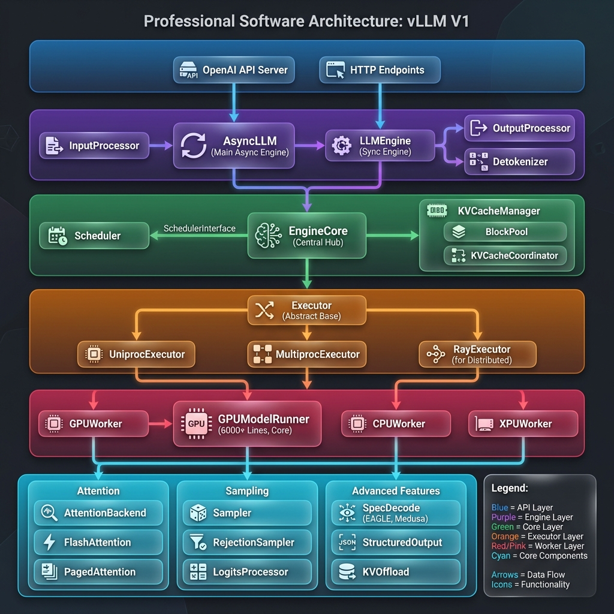
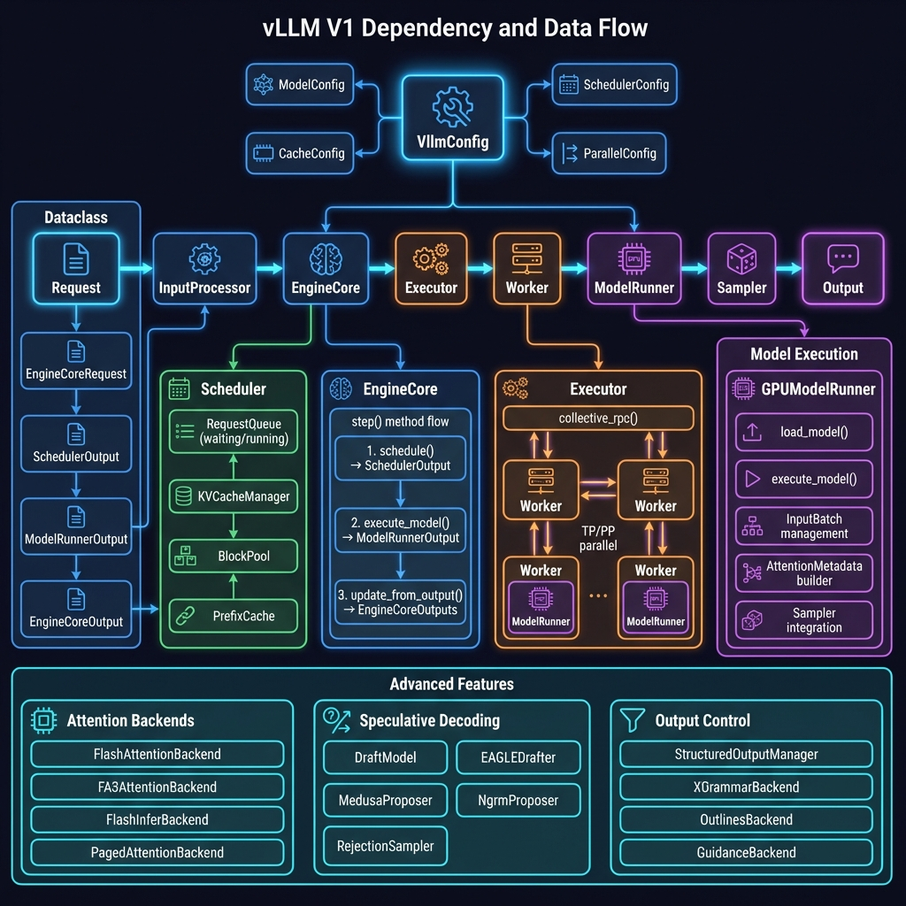
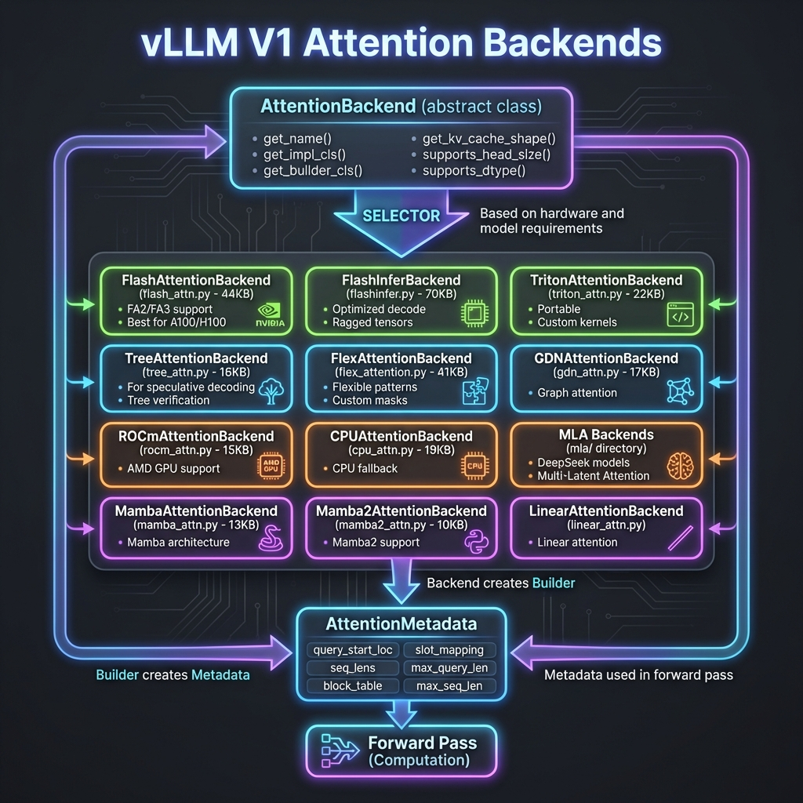
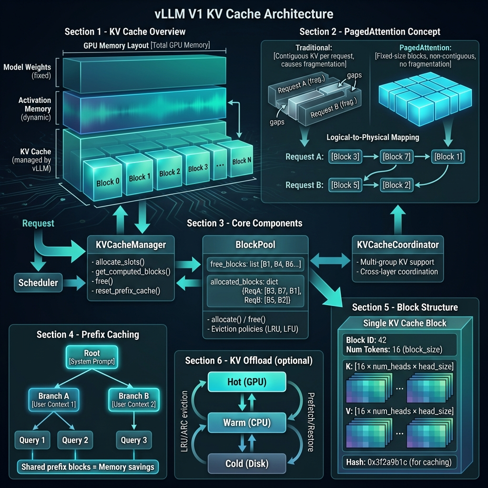
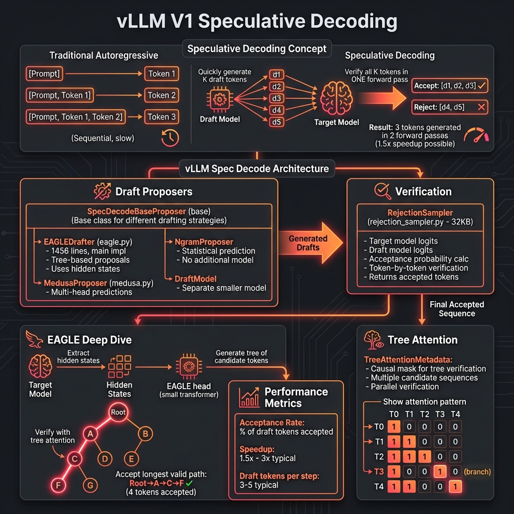
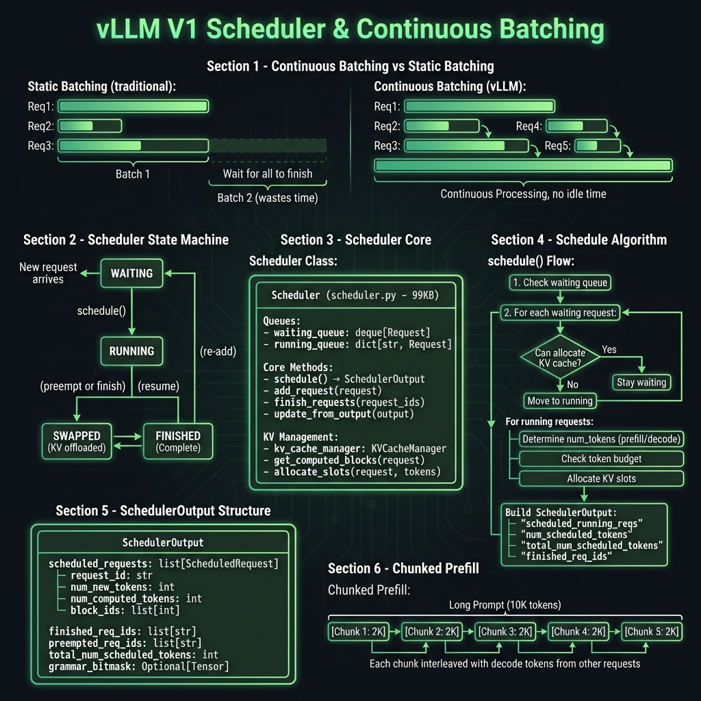
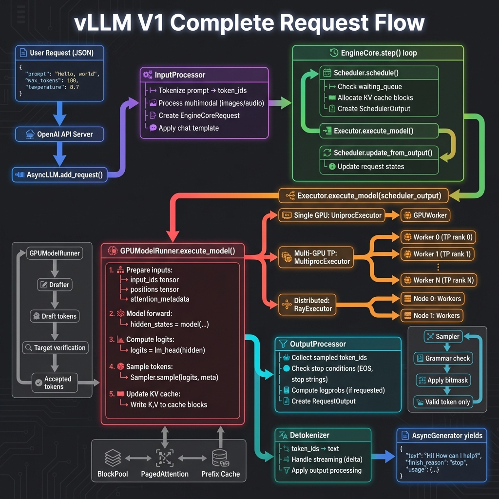

# vLLM V1 架构详解

## 📋 概述

vLLM V1 是 vLLM 项目的新一代推理引擎架构，相比旧版进行了全面的模块化重构。本文档详细介绍 V1 架构中各模块的功能和交互关系。

---

## 🏗️ 整体架构

vLLM V1 采用分层架构设计，从上到下分为以下几层：

```
┌─────────────────────────────────────────────────────────────┐
│                    API Layer (API 层)                       │
│              OpenAI API Server / HTTP Endpoints             │
├─────────────────────────────────────────────────────────────┤
│                   Engine Layer (引擎层)                      │
│     AsyncLLM / LLMEngine / InputProcessor / Detokenizer     │
├─────────────────────────────────────────────────────────────┤
│                    Core Layer (核心层)                       │
│        EngineCore / Scheduler / KVCacheManager              │
├─────────────────────────────────────────────────────────────┤
│                  Executor Layer (执行器层)                   │
│      UniprocExecutor / MultiprocExecutor / RayExecutor      │
├─────────────────────────────────────────────────────────────┤
│                   Worker Layer (工作节点层)                  │
│        GPUWorker / GPUModelRunner / CPUWorker               │
├─────────────────────────────────────────────────────────────┤
│               Core Components (核心组件层)                   │
│   Attention / Sampling / SpecDecode / StructuredOutput     │
└─────────────────────────────────────────────────────────────┘
```

---

## 📁 模块详解

### 1. 🚀 Engine (引擎模块) - `vllm/v1/engine/`

引擎模块是 vLLM 的入口点，负责处理用户请求的完整生命周期。

| 文件 | 核心类 | 功能说明 |
|------|--------|----------|
| `async_llm.py` | `AsyncLLM` | 异步引擎，支持并发请求处理，是生产环境的主要接口 |
| `llm_engine.py` | `LLMEngine` | 同步引擎，用于简单场景和测试 |
| `core.py` | `EngineCore` | 引擎核心逻辑，协调调度器和执行器 |
| `core_client.py` | `EngineCoreClient` | 引擎核心的客户端封装 |
| `input_processor.py` | `InputProcessor` | 输入预处理，包括 tokenization 和多模态处理 |
| `output_processor.py` | `OutputProcessor` | 输出后处理，构建最终响应 |
| `detokenizer.py` | `Detokenizer` | 将 token ID 转换回文本 |
| `logprobs.py` | - | Log 概率计算工具 |

**核心流程：**
```python
# EngineCore.step() 的核心循环
def step(self):
    # 1. 调度 - 决定本次迭代处理哪些请求
    scheduler_output = self.scheduler.schedule()
    
    # 2. 执行 - 运行模型前向传播
    model_output = self.executor.execute_model(scheduler_output)
    
    # 3. 更新 - 处理输出并更新状态
    outputs = self.scheduler.update_from_output(scheduler_output, model_output)
    
    return outputs
```

---

### 2. 📊 Core (核心调度模块) - `vllm/v1/core/`

核心模块负责请求调度和 KV Cache 管理，是 vLLM 高性能的关键。

#### 2.1 调度器 (`sched/`)

| 文件 | 核心类 | 功能说明 |
|------|--------|----------|
| `interface.py` | `SchedulerInterface` | 调度器抽象接口 |
| `scheduler.py` | `Scheduler` | 主调度器实现 (99KB，核心逻辑) |
| `async_scheduler.py` | `AsyncScheduler` | 异步调度器 |
| `output.py` | `SchedulerOutput` | 调度输出数据结构 |
| `request_queue.py` | `RequestQueue` | 请求队列管理 |

**调度器核心功能：**
- 管理 **waiting queue** (等待队列) 和 **running queue** (运行队列)
- 实现 **Continuous Batching** (连续批处理)
- 支持 **Chunked Prefill** (分块预填充)
- 与 KV Cache 管理器协调内存分配

#### 2.2 KV Cache 管理

| 文件 | 核心类 | 功能说明 |
|------|--------|----------|
| `kv_cache_manager.py` | `KVCacheManager` | KV Cache 管理器主接口 |
| `single_type_kv_cache_manager.py` | `SingleTypeKVCacheManager` | 单类型 KV Cache 管理 |
| `kv_cache_coordinator.py` | `KVCacheCoordinator` | 多类型 KV Cache 协调 |
| `block_pool.py` | `BlockPool` | 内存块池管理 |
| `kv_cache_utils.py` | - | KV Cache 工具函数 (66KB) |
| `encoder_cache_manager.py` | `EncoderCacheManager` | 编码器缓存 (多模态) |

**KV Cache 管理特性：**
- **PagedAttention**: 分页式 KV Cache，避免内存碎片
- **Prefix Caching**: 前缀缓存，复用相同前缀的 KV
- **Block Pool**: 块池管理，高效的内存分配/释放

---

### 3. ⚡ Executor (执行器模块) - `vllm/v1/executor/`

执行器负责将计算任务分发到不同的执行环境。

| 文件 | 核心类 | 功能说明 |
|------|--------|----------|
| `abstract.py` | `Executor` | 执行器抽象基类 |
| `uniproc_executor.py` | `UniprocExecutor` | 单进程执行器 |
| `multiproc_executor.py` | `MultiprocExecutor` | 多进程执行器 (Tensor Parallel) |
| `ray_executor.py` | `RayExecutor` | Ray 分布式执行器 |
| `ray_utils.py` | - | Ray 工具函数 |

**执行模式：**
```
单 GPU:     UniprocExecutor → 1 GPUWorker
多 GPU TP:  MultiprocExecutor → N GPUWorkers (Tensor Parallel)
分布式:     RayExecutor → 跨节点 GPUWorkers
```

---

### 4. 👷 Worker (工作节点模块) - `vllm/v1/worker/`

工作节点是实际执行模型推理的组件。

| 文件 | 核心类 | 功能说明 | 代码规模 |
|------|--------|----------|----------|
| `gpu_model_runner.py` | `GPUModelRunner` | **GPU 模型运行器 (核心)** | **6067 行** |
| `gpu_worker.py` | `GPUWorker` | GPU 工作节点 | 41KB |
| `gpu_input_batch.py` | `InputBatch` | GPU 输入批处理 | 44KB |
| `cpu_model_runner.py` | `CPUModelRunner` | CPU 模型运行器 | 4KB |
| `cpu_worker.py` | `CPUWorker` | CPU 工作节点 | 8KB |
| `xpu_model_runner.py` | `XPUModelRunner` | Intel XPU 运行器 | 1KB |
| `xpu_worker.py` | `XPUWorker` | Intel XPU 工作节点 | 7KB |
| `block_table.py` | `BlockTable` | 块表管理 | 14KB |
| `worker_base.py` | `WorkerBase` | 工作节点基类 | 14KB |

**GPUModelRunner 核心方法：**
```python
class GPUModelRunner:
    def __init__(self, vllm_config, device):
        # 初始化模型、注意力后端、采样器等
        
    def load_model(self):
        # 加载模型权重
        
    def execute_model(self, scheduler_output):
        # 1. 准备输入 (tokens, positions, attention metadata)
        # 2. 模型前向传播
        # 3. 采样生成 token
        # 4. 返回 ModelRunnerOutput
```

---

### 5. 👁️ Attention (注意力模块) - `vllm/v1/attention/`

注意力模块实现高效的注意力计算。

| 文件/目录 | 功能说明 |
|-----------|----------|
| `backend.py` | 注意力后端抽象基类 `AttentionBackend` |
| `selector.py` | 自动选择最优注意力后端 |
| `backends/` | 具体后端实现 |
| `ops/` | 注意力算子 |

**支持的注意力后端：**
- **FlashAttention V2/V3**: NVIDIA GPU 优化
- **FlashInfer**: 高性能推理优化
- **PagedAttention**: vLLM 原生分页注意力
- **MLA (Multi-Latent Attention)**: DeepSeek 模型支持

---

### 6. 🎲 Sample (采样模块) - `vllm/v1/sample/`

采样模块负责从模型输出概率分布中采样 token。

| 文件/目录 | 核心类 | 功能说明 |
|-----------|--------|----------|
| `sampler.py` | `Sampler` | 主采样器 |
| `rejection_sampler.py` | `RejectionSampler` | 拒绝采样 (推测解码) |
| `metadata.py` | `SamplingMetadata` | 采样元数据 |
| `logits_processor/` | - | Logits 处理器 |
| `ops/` | - | 采样算子 |

**采样流程：**
```python
def sample(logits, sampling_metadata):
    # 1. 应用温度 (temperature)
    # 2. 应用惩罚 (repetition, frequency, presence)
    # 3. 应用 logits processor
    # 4. Top-K / Top-P 过滤
    # 5. 采样或 argmax (greedy)
    # 6. 计算 logprobs (如需要)
```

---

### 7. 🚄 Spec Decode (推测解码模块) - `vllm/v1/spec_decode/`

推测解码通过并行验证加速生成。

| 文件 | 核心类 | 功能说明 |
|------|--------|----------|
| `eagle.py` | `EAGLEDrafter` | **EAGLE 推测解码** (64KB，主力实现) |
| `medusa.py` | `MedusaProposer` | Medusa 多头推测 |
| `draft_model.py` | `DraftModel` | 草稿模型基类 |
| `ngram_proposer.py` | `NgramProposer` | N-gram 提议器 |
| `suffix_decoding.py` | - | 后缀解码 |
| `metrics.py` | - | 推测解码指标 |

**推测解码原理：**
```
1. 草稿模型快速生成 K 个候选 token
2. 目标模型一次性验证所有候选
3. 接受正确的 token，拒绝错误的
4. 平均加速 2-3x
```

---

### 8. 📝 Structured Output (结构化输出模块) - `vllm/v1/structured_output/`

支持 JSON Schema、正则表达式等约束输出。

| 文件 | 功能说明 |
|------|----------|
| `backend_xgrammar.py` | XGrammar 后端 (推荐) |
| `backend_outlines.py` | Outlines 后端 |
| `backend_guidance.py` | Guidance 后端 |
| `backend_lm_format_enforcer.py` | LM Format Enforcer |
| `backend_types.py` | 后端类型定义 |

---

### 9. 💾 KV Offload (KV Cache 卸载模块) - `vllm/v1/kv_offload/`

将 KV Cache 卸载到 CPU/磁盘以支持更长上下文。

| 文件 | 功能说明 |
|------|----------|
| `abstract.py` | 卸载管理器抽象基类 |
| `arc_manager.py` | ARC 缓存策略 |
| `lru_manager.py` | LRU 缓存策略 |
| `cpu.py` | CPU 卸载实现 |
| `backends/` | 具体后端 |
| `worker/` | 卸载工作节点 |

---

### 10. 📈 Metrics (指标监控模块) - `vllm/v1/metrics/`

性能监控和指标收集。

| 文件 | 功能说明 |
|------|----------|
| `loggers.py` | 日志记录器 (49KB) |
| `perf.py` | 性能监控 (44KB) |
| `prometheus.py` | Prometheus 导出 |
| `stats.py` | 统计信息 |
| `reader.py` | 指标读取 |

---

## 🔄 请求处理流程

```
用户请求
    │
    ▼
┌─────────────────┐
│  AsyncLLM      │ ← 接收请求
│  add_request() │
└────────┬────────┘
         │
         ▼
┌─────────────────┐
│ InputProcessor │ ← Tokenize + 多模态处理
│  process()     │
└────────┬────────┘
         │
         ▼
┌─────────────────┐
│  EngineCore    │ ← 核心调度循环
│    step()      │
└────────┬────────┘
         │
    ┌────┴────┐
    │         │
    ▼         ▼
┌────────┐  ┌─────────────────┐
│Scheduler│  │  KVCacheManager │
│schedule()│ │   allocate()    │
└────┬───┘  └────────┬────────┘
     │               │
     └───────┬───────┘
             │
             ▼
      SchedulerOutput
             │
             ▼
┌─────────────────┐
│   Executor     │ ← 分发执行
│ execute_model()│
└────────┬────────┘
         │
         ▼
┌─────────────────┐
│  GPUWorker     │
│  GPUModelRunner│ ← 实际推理
│ execute_model()│
└────────┬────────┘
         │
    ┌────┴────┐
    │         │
    ▼         ▼
┌────────┐  ┌─────────┐
│ Model  │  │ Sampler │
│Forward │→ │ sample()│
└────────┘  └────┬────┘
                 │
                 ▼
         ModelRunnerOutput
                 │
                 ▼
┌─────────────────┐
│  Detokenizer   │ ← 解码输出
│  detokenize()  │
└────────┬────────┘
         │
         ▼
      用户响应
```

---

## 🎯 总结

vLLM V1 架构的核心设计理念：

1. **模块化**: 各组件解耦，便于扩展和测试
2. **高性能**: PagedAttention + Continuous Batching
3. **可扩展**: 支持多种硬件后端和分布式部署
4. **灵活性**: 支持推测解码、结构化输出等高级特性

**关键代码量统计：**
- `gpu_model_runner.py`: **6067 行** (核心推理逻辑)
- `scheduler.py`: **99KB** (调度核心)
- `kv_cache_utils.py`: **66KB** (KV Cache 工具)
- `eagle.py`: **64KB** (EAGLE 推测解码)

---

## 📊 架构图

本文档配套以下架构图，位于 `docs/images/` 目录：

### 1. vLLM V1 整体架构图

展示 V1 的分层架构设计，包括 API 层、引擎层、核心层、执行器层、工作节点层和核心组件层。



---

### 2. 模块依赖与数据流图

展示各模块之间的交互关系：VllmConfig 配置中心、请求处理流水线、EngineCore 核心循环等。



---

### 3. 注意力后端架构图

详细展示 20+ 种注意力后端实现：FlashAttention、FlashInfer、Tree Attention、Mamba 等。



---

### 4. KV Cache 架构图

PagedAttention 核心原理：GPU 内存布局、逻辑到物理块映射、前缀缓存、KV Offload。



---

### 5. 推测解码架构图

推测解码加速技术：EAGLE、Medusa、Ngram 提议器，拒绝采样验证流程。



---

### 6. 调度器架构图

Continuous Batching 和调度：请求状态机、Scheduler 核心逻辑、Chunked Prefill。



---

### 7. 完整请求流程图

端到端请求处理：从 JSON 请求到响应返回的完整数据流。



---

## 🔧 深入技术细节

### Attention Backends 详解

vLLM V1 支持 **20+ 种注意力后端**，根据硬件和模型自动选择最优实现：

| 后端 | 文件大小 | 适用场景 |
|------|----------|----------|
| `FlashAttentionBackend` | 44KB | NVIDIA A100/H100, FA2/FA3 |
| `FlashInferBackend` | 70KB | 优化解码，Ragged Tensors |
| `TritonAttentionBackend` | 22KB | 可移植，自定义 Kernel |
| `TreeAttentionBackend` | 16KB | 推测解码验证 |
| `FlexAttentionBackend` | 41KB | 灵活注意力模式 |
| `ROCmAttentionBackend` | 15KB | AMD GPU |
| `CPUAttentionBackend` | 19KB | CPU 回退 |
| `MambaAttentionBackend` | 13KB | Mamba 架构 |

### GPUModelRunner 核心方法

`GPUModelRunner` 是 vLLM 最核心的类，包含 **6067 行代码**：

```python
class GPUModelRunner:
    def __init__(self, vllm_config, device):
        # 初始化模型、KV Cache、采样器等 (700+ 行)
        
    def load_model(self):
        # 加载模型权重，支持分布式
        
    def execute_model(self, scheduler_output) -> ModelRunnerOutput:
        # 核心推理逻辑
        # 1. 准备输入张量
        # 2. 构建 AttentionMetadata
        # 3. 模型前向传播
        # 4. 采样生成 token
        # 5. (可选) 推测解码
        # 6. 返回输出
        
    def _prepare_inputs(self, scheduler_output):
        # 准备 input_ids, positions, slot_mapping 等
        
    def _build_attention_metadata(self, ...):
        # 构建注意力元数据
```

### 性能优化技术

| 技术 | 描述 | 加速效果 |
|------|------|----------|
| **PagedAttention** | 分页式 KV Cache，消除内存碎片 | 内存效率 ↑ 20-30% |
| **Continuous Batching** | 连续批处理，动态请求管理 | 吞吐量 ↑ 2-3x |
| **Prefix Caching** | 前缀缓存复用 | 相同前缀请求 ↑ 10x+ |
| **Speculative Decoding** | 推测解码并行验证 | 延迟 ↓ 1.5-3x |
| **Chunked Prefill** | 分块预填充，交错处理 | TTFT ↓ |
| **CUDA Graphs** | 图化执行，减少 CPU 开销 | 小批量 ↑ 30-50% |
| **Tensor Parallelism** | 张量并行，多 GPU 切分 | 大模型支持 |

---

## 📚 参考资源

- [vLLM 官方文档](https://docs.vllm.ai/)
- [PagedAttention 论文](https://arxiv.org/abs/2309.06180)
- [EAGLE 推测解码](https://arxiv.org/abs/2401.15077)
- [FlashAttention 2](https://arxiv.org/abs/2307.08691)
