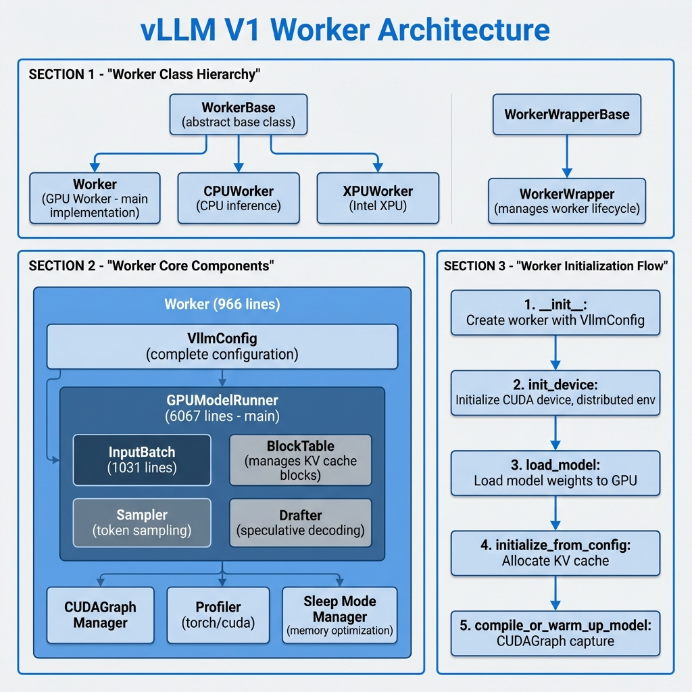
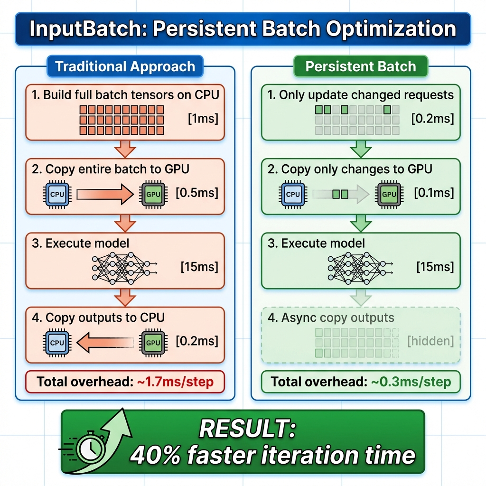
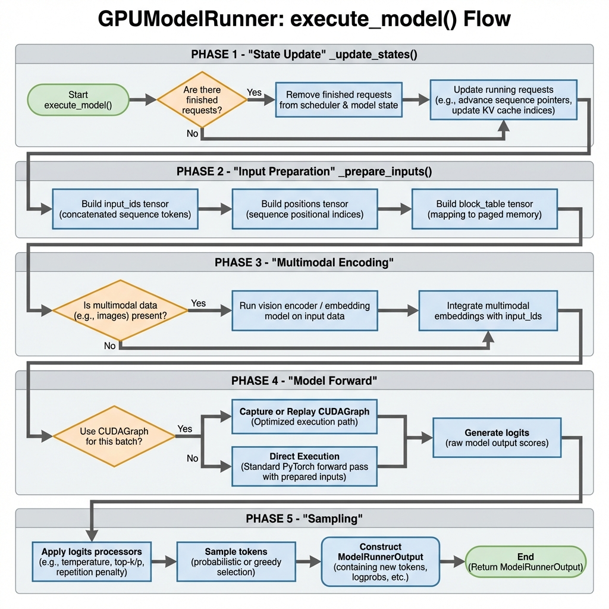
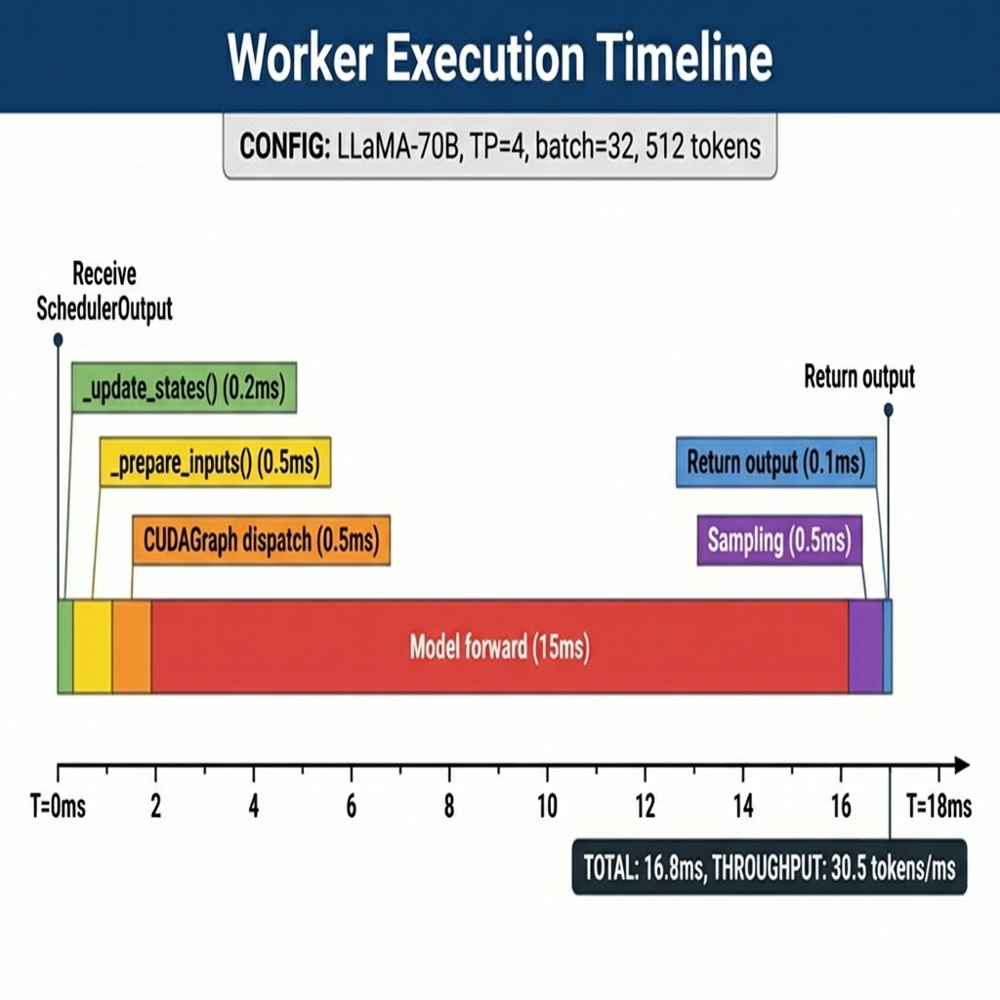

# vLLM Worker 架构深度解析

> 本文档深入分析 vLLM V1 的 Worker 架构，包括 Worker 类层次结构、GPUModelRunner 执行流程、InputBatch 持久化批次优化和完整执行示例。

## 目录

1. [Worker 概述](#worker-概述)
2. [Worker 类层次结构](#worker-类层次结构)
3. [GPUModelRunner 详解](#gpumodelrunner-详解)
4. [InputBatch 持久化批次](#inputbatch-持久化批次)
5. [执行流程详解](#执行流程详解)
6. [完整执行示例](#完整执行示例)
7. [性能优化与最佳实践](#性能优化与最佳实践)

---

## Worker 概述

### 什么是 Worker？

**Worker** 是 vLLM 中负责实际模型执行的组件。每个 Worker 运行在一个设备（GPU/CPU/XPU）上，负责：

1. **设备初始化**：设置 CUDA 设备、分布式环境
2. **模型加载**：将模型权重加载到 GPU 内存
3. **KV Cache 管理**：分配和管理 KV 缓存块
4. **模型执行**：运行前向传播和采样
5. **内存管理**：支持休眠模式等高级内存优化

### 关键特性

| 特性 | 说明 |
|------|------|
| 分布式执行 | 支持 TP/PP/DP 多种并行模式 |
| CUDAGraph | 减少 kernel 启动开销 |
| 持久化批次 | 增量更新批次状态 |
| Sleep Mode | 动态释放模型权重 |
| 异步调度 | 重叠计算和通信 |

---

## Worker 类层次结构

### 架构概览



*图1: vLLM V1 Worker 架构图 - 展示类层次结构、核心组件和初始化流程*

### 类继承关系

```
vllm/v1/worker/
├── worker_base.py          # WorkerBase 抽象基类
├── gpu_worker.py           # Worker GPU 实现 (966行)
├── cpu_worker.py           # CPUWorker 实现
├── xpu_worker.py           # XPUWorker 实现
├── gpu_model_runner.py     # GPUModelRunner (6067行)
├── gpu_input_batch.py      # InputBatch 实现 (1031行)
├── block_table.py          # BlockTable 块表管理
└── gpu/                    # GPU 子模块
    ├── model_runner.py     # GPUModelRunner V2
    ├── input_batch.py
    └── ...
```

### WorkerBase 抽象基类

```python
class WorkerBase:
    """Worker interface for different hardware implementations."""
    
    def __init__(
        self,
        vllm_config: VllmConfig,
        local_rank: int,
        rank: int,
        distributed_init_method: str,
        is_driver_worker: bool = False,
    ) -> None:
        # 核心配置
        self.vllm_config = vllm_config
        self.model_config = vllm_config.model_config
        self.cache_config = vllm_config.cache_config
        self.parallel_config = vllm_config.parallel_config
        self.scheduler_config = vllm_config.scheduler_config
        
        # 设备状态
        self.local_rank = local_rank
        self.rank = rank
        self.device: torch.device | None = None
        self.model_runner: nn.Module | None = None
    
    # 抽象方法
    def init_device(self) -> None: ...
    def load_model(self) -> None: ...
    def execute_model(self, scheduler_output) -> ModelRunnerOutput | None: ...
    def sample_tokens(self, grammar_output) -> ModelRunnerOutput: ...
    def get_kv_cache_spec(self) -> dict[str, KVCacheSpec]: ...
```

### Worker (GPU 实现)

```python
class Worker(WorkerBase):
    """A GPU worker class for vLLM V1."""
    
    def __init__(
        self,
        vllm_config: VllmConfig,
        local_rank: int,
        rank: int,
        distributed_init_method: str,
        is_driver_worker: bool = False,
    ):
        super().__init__(...)
        
        # 精度设置
        precision = envs.VLLM_FLOAT32_MATMUL_PRECISION
        torch.set_float32_matmul_precision(precision)
        
        # 休眠模式支持
        self._sleep_saved_buffers: dict[str, torch.Tensor] = {}
        
        # Profiler
        self.profiler: TorchProfilerWrapper | CudaProfilerWrapper | None
        
        # Model Runner 版本选择
        self.use_v2_model_runner = envs.VLLM_USE_V2_MODEL_RUNNER
```

### WorkerWrapperBase

```python
class WorkerWrapperBase:
    """Manages worker lifecycle for distributed execution."""
    
    def __init__(
        self,
        rpc_rank: int = 0,
        global_rank: int | None = None,
    ) -> None:
        self.rpc_rank = rpc_rank
        self.global_rank = global_rank
        self.worker: WorkerBase
        self.vllm_config: VllmConfig
    
    def init_worker(self, all_kwargs: list[dict[str, Any]]) -> None:
        """Initialize the actual worker instance."""
        kwargs = all_kwargs[self.rpc_rank]
        vllm_config = kwargs.get("vllm_config")
        
        # 加载插件
        load_general_plugins()
        
        # 动态加载 Worker 类
        worker_class = resolve_obj_by_qualname(
            parallel_config.worker_cls
        )
        
        # 创建 Worker 实例
        self.worker = worker_class(**kwargs)
    
    def execute_model(self, scheduler_output) -> ModelRunnerOutput | None:
        """Execute model with multimodal cache handling."""
        self._apply_mm_cache(scheduler_output)
        return self.worker.execute_model(scheduler_output)
```

---

## GPUModelRunner 详解

### 核心架构

`GPUModelRunner` 是 vLLM 中最复杂的组件之一（6067行代码），负责：

1. **输入准备**：构建模型输入张量
2. **模型执行**：运行 Transformer 前向传播
3. **KV Cache 管理**：更新注意力缓存
4. **采样**：根据 logits 生成 token
5. **CUDAGraph**：优化执行性能

### 初始化

```python
class GPUModelRunner(
    KVConnectorModelRunnerMixin,
    ECConnectorModelRunnerMixin,
    LoRAModelRunnerMixin,
):
    def __init__(
        self,
        vllm_config: VllmConfig,
        device: torch.device,
    ):
        # 配置
        self.vllm_config = vllm_config
        self.model_config = vllm_config.model_config
        self.device = device
        
        # 关键限制
        self.max_num_reqs = scheduler_config.max_num_seqs
        self.max_num_tokens = scheduler_config.max_num_batched_tokens
        self.max_model_len = model_config.max_model_len
        
        # 持久化批次
        self.input_batch = InputBatch(
            max_num_reqs=self.max_num_reqs,
            max_model_len=self.max_model_len,
            max_num_batched_tokens=self.max_num_tokens,
            device=self.device,
            vocab_size=self.model_config.get_vocab_size(),
            ...
        )
        
        # 请求状态缓存
        self.requests: dict[str, CachedRequestState] = {}
        
        # 采样器
        self.sampler = Sampler(logprobs_mode=model_config.logprobs_mode)
        
        # 投机解码支持
        if self.speculative_config:
            self.drafter: NgramProposer | EagleProposer | ...
            self.rejection_sampler = RejectionSampler(self.sampler)
        
        # GPU 常驻缓冲区
        self.input_ids = self._make_buffer(self.max_num_tokens, dtype=torch.int32)
        self.positions = self._make_buffer(self.max_num_tokens, dtype=torch.int64)
        self.seq_lens = self._make_buffer(self.max_num_reqs, dtype=torch.int32)
        
        # CUDAGraph 调度器
        self.cudagraph_dispatcher = CudagraphDispatcher(self.vllm_config)
```

### CachedRequestState

每个请求在 ModelRunner 中维护缓存状态：

```python
@dataclass
class CachedRequestState:
    req_id: str
    prompt_token_ids: list[int] | None
    mm_features: list[MultiModalFeatureSpec]
    sampling_params: SamplingParams | None
    generator: torch.Generator | None
    
    block_ids: tuple[list[int], ...]
    num_computed_tokens: int
    output_token_ids: list[int]
    
    # M-RoPE 位置（如 Qwen2-VL）
    mrope_positions: torch.Tensor | None = None
    mrope_position_delta: int | None = None
    
    # LoRA
    lora_request: LoRARequest | None = None
    prompt_embeds: torch.Tensor | None = None
    
    @property
    def num_tokens(self) -> int:
        return self.num_prompt_tokens + len(self.output_token_ids)
```

---

## InputBatch 持久化批次

### 核心概念



*图3: InputBatch 持久化批次优化 - 对比传统方式和增量更新方式的性能差异*

**持久化批次优化** 是 vLLM V1 的关键性能优化。传统做法是每步重新构建完整批次，而持久化批次只进行增量更新。

```
传统方式 (每步):
┌────────────────────────────────────────────────┐
│ 1. 从头构建批次张量 (CPU)  [~1ms]             │
│ 2. 复制整个批次到 GPU      [~0.5ms]           │
│ 3. 执行模型                [~15ms]            │
│ 4. 复制输出到 CPU          [~0.2ms]           │
└────────────────────────────────────────────────┘

持久化批次 (增量更新):
┌────────────────────────────────────────────────┐
│ 1. 增量更新变化的部分 (CPU) [~0.2ms]          │
│ 2. 只复制变化的数据到 GPU   [~0.1ms]          │
│ 3. 执行模型                 [~15ms]           │
│ 4. 异步复制输出到 CPU       [~0ms 隐藏]       │
└────────────────────────────────────────────────┘
```

**收益**：~40% 迭代时间减少

### InputBatch 数据结构

```python
class InputBatch:
    def __init__(
        self,
        max_num_reqs: int,
        max_model_len: int,
        max_num_batched_tokens: int,
        device: torch.device,
        pin_memory: bool,
        vocab_size: int,
        block_sizes: list[int],
        ...
    ):
        # ========== 请求管理 ==========
        self._req_ids: list[str | None] = []
        self.req_id_to_index: dict[str, int] = {}
        
        # ========== Token 数据 (CPU) ==========
        # [max_reqs, max_model_len] - 存储所有 token ID
        self.token_ids_cpu = torch.zeros(
            (max_num_reqs, max_model_len),
            dtype=torch.int32, device="cpu"
        ).numpy()
        
        # 标记哪些位置是真实 token（非 embedding）
        self.is_token_ids = torch.zeros(
            (max_num_reqs, max_model_len), dtype=bool
        ).numpy()
        
        # 每个请求的 token 数量
        self.num_tokens_no_spec = np.zeros(max_num_reqs, dtype=np.int32)
        self.num_prompt_tokens = np.zeros(max_num_reqs, dtype=np.int32)
        self.num_computed_tokens_cpu = np.zeros(max_num_reqs, dtype=np.int32)
        
        # ========== Block Table ==========
        self.block_table = MultiGroupBlockTable(
            max_num_reqs=max_num_reqs,
            max_model_len=max_model_len,
            block_sizes=block_sizes,
            ...
        )
        
        # ========== 采样参数 (CPU + GPU) ==========
        # CPU 端用于更新，GPU 端用于执行
        self.temperature = torch.empty(max_num_reqs, dtype=torch.float32, device=device)
        self.temperature_cpu = torch.empty(max_num_reqs, dtype=torch.float32).numpy()
        
        self.top_p = torch.empty(max_num_reqs, dtype=torch.float32, device=device)
        self.top_k = torch.empty(max_num_reqs, dtype=torch.int32, device=device)
        
        # 惩罚参数
        self.frequency_penalties = torch.empty(max_num_reqs, dtype=torch.float, device=device)
        self.presence_penalties = torch.empty(max_num_reqs, dtype=torch.float, device=device)
        self.repetition_penalties = torch.empty(max_num_reqs, dtype=torch.float, device=device)
        
        # ========== 请求集合 (追踪) ==========
        self.greedy_reqs: set[str] = set()
        self.random_reqs: set[str] = set()
        self.top_p_reqs: set[str] = set()
        self.top_k_reqs: set[str] = set()
        
        # ========== 随机数生成器 ==========
        self.generators: dict[int, torch.Generator] = {}
```

### 批次操作

#### add_request

```python
def add_request(self, request: CachedRequestState) -> int:
    """添加请求到批次"""
    req_index = self._register_add_request(request)
    req_id = request.req_id
    
    # 更新请求 ID 列表
    if req_index == len(self._req_ids):
        self._req_ids.append(req_id)
    else:
        self._req_ids[req_index] = req_id
    
    self.req_id_to_index[req_id] = req_index
    
    # 复制 token IDs
    num_prompt_tokens = len(request.prompt_token_ids)
    self.num_prompt_tokens[req_index] = num_prompt_tokens
    self.token_ids_cpu[req_index, :num_prompt_tokens] = request.prompt_token_ids
    
    # 设置采样参数
    sampling_params = request.sampling_params
    if sampling_params.sampling_type == SamplingType.GREEDY:
        self.temperature_cpu[req_index] = 0.0
        self.greedy_reqs.add(req_id)
    else:
        self.temperature_cpu[req_index] = sampling_params.temperature
        self.random_reqs.add(req_id)
    
    # 添加到 block table
    self.block_table.add_row(request.block_ids, req_index)
    
    return req_index
```

#### remove_request

```python
def remove_request(self, req_id: str) -> int | None:
    """从批次中移除请求（延迟清理）"""
    req_index = self.req_id_to_index.pop(req_id, None)
    if req_index is None:
        return None
    
    # 标记为待移除
    self.batch_update_builder.removed_append(req_index)
    self._req_ids[req_index] = None
    
    # 清理追踪集合
    self.greedy_reqs.discard(req_id)
    self.random_reqs.discard(req_id)
    self.generators.pop(req_index, None)
    
    return req_index
```

#### condense

```python
def condense(self) -> None:
    """压缩批次，填补空洞"""
    num_reqs = self.num_reqs
    empty_req_indices = self.batch_update_builder.removed
    
    if not empty_req_indices:
        return
    
    if num_reqs == 0:
        self._req_ids.clear()
        return
    
    # 将末尾的活跃请求移动到空洞位置
    last_req_index = num_reqs + len(empty_req_indices) - 1
    while empty_req_indices:
        # 找到最大的非空索引
        while last_req_index in empty_req_indices:
            last_req_index -= 1
        
        # 找到最小的空洞索引
        empty_index = self.batch_update_builder.peek_removed()
        if empty_index >= last_req_index:
            break
        
        # 移动请求
        self.batch_update_builder.pop_removed()
        req_id = self._req_ids[last_req_index]
        
        self._req_ids[empty_index] = req_id
        self._req_ids[last_req_index] = None
        self.req_id_to_index[req_id] = empty_index
        
        # 复制数据
        num_tokens = self.num_tokens_no_spec[last_req_index]
        self.token_ids_cpu[empty_index, :num_tokens] = (
            self.token_ids_cpu[last_req_index, :num_tokens]
        )
        self.block_table.move_row(last_req_index, empty_index)
        
        last_req_index -= 1
    
    # 裁剪列表
    del self._req_ids[num_reqs:]
```

---

## 执行流程详解

### execute_model 主流程



*图2: GPUModelRunner execute_model() 执行流程 - 从状态更新到采样的完整流程*

```python
def execute_model(
    self, scheduler_output: SchedulerOutput
) -> ModelRunnerOutput | AsyncModelRunnerOutput | None:
    """主执行入口"""
    
    # Phase 1: 状态更新
    self._update_states(scheduler_output)
    
    # Phase 2: 输入准备
    num_tokens = scheduler_output.total_num_scheduled_tokens
    attn_metadata, logits_indices = self._prepare_inputs(scheduler_output)
    
    # Phase 3: 多模态编码 (如果需要)
    if self.supports_mm_inputs:
        self._execute_mm_encoder(scheduler_output)
    
    # Phase 4: CUDAGraph 调度
    use_cudagraph, batch_desc = self.cudagraph_dispatcher.dispatch(num_tokens)
    
    # Phase 5: 模型前向
    with set_forward_context(attn_metadata, self.vllm_config, ...):
        if isinstance(use_cudagraph, torch.cuda.CUDAGraph):
            # 使用 CUDAGraph
            hidden_states = self._cudagraph_replay(use_cudagraph, batch_desc)
        else:
            # 直接执行
            hidden_states = self.model(
                input_ids=self.input_ids.gpu[:num_tokens],
                positions=self.positions.gpu[:num_tokens],
                kv_caches=self.kv_caches,
                attn_metadata=attn_metadata,
            )
    
    # Phase 6: 采样 (最后一个 PP rank)
    if get_pp_group().is_last_rank:
        # 计算 logits
        logits = self.model.compute_logits(hidden_states, None)
        
        # 采样
        return self._execute_sampler(
            logits=logits,
            scheduler_output=scheduler_output,
            logits_indices=logits_indices,
        )
    else:
        # 中间 PP rank, 返回 intermediate tensors
        return IntermediateTensors({"hidden_states": hidden_states})
```

### _update_states 状态更新

```python
def _update_states(self, scheduler_output: SchedulerOutput) -> None:
    """更新缓存状态和持久化批次"""
    
    # Step 1: 移除已完成的请求
    for req_id in scheduler_output.finished_req_ids:
        self.requests.pop(req_id, None)
        self.input_batch.remove_request(req_id)
    
    # Step 2: 释放编码器缓存
    for mm_hash in scheduler_output.free_encoder_mm_hashes:
        self.encoder_cache.pop(mm_hash, None)
    
    # Step 3: 移除未调度的请求（抢占的请求保留缓存状态）
    scheduled_req_ids = scheduler_output.num_scheduled_tokens.keys()
    cached_req_ids = self.input_batch.req_id_to_index.keys()
    unscheduled_req_ids = cached_req_ids - scheduled_req_ids
    
    for req_id in unscheduled_req_ids:
        self.input_batch.remove_request(req_id)
    
    # Step 4: 添加新请求
    for new_req_data in scheduler_output.scheduled_new_reqs:
        req_state = CachedRequestState(
            req_id=new_req_data.req_id,
            prompt_token_ids=new_req_data.prompt_token_ids,
            sampling_params=new_req_data.sampling_params,
            ...
        )
        self.requests[req_id] = req_state
        self.input_batch.add_request(req_state)
    
    # Step 5: 更新运行中的请求
    for i, req_id in enumerate(scheduler_output.scheduled_cached_reqs.req_ids):
        req_state = self.requests[req_id]
        num_computed_tokens = scheduler_output.scheduled_cached_reqs.num_computed_tokens[i]
        new_block_ids = scheduler_output.scheduled_cached_reqs.new_block_ids[i]
        
        req_state.num_computed_tokens = num_computed_tokens
        
        if new_block_ids is not None:
            for block_ids, new_ids in zip(req_state.block_ids, new_block_ids):
                block_ids.extend(new_ids)
        
        self.input_batch.block_table.append_row(new_block_ids, req_index)
    
    # Step 6: 压缩和刷新
    self.input_batch.condense()
    self._may_reorder_batch(scheduler_output)
    self.input_batch.refresh_metadata()
```

### _prepare_inputs 输入准备

```python
def _prepare_inputs(
    self, scheduler_output: SchedulerOutput
) -> tuple[AttentionMetadata, torch.Tensor]:
    """准备模型输入张量"""
    
    num_reqs = self.input_batch.num_reqs
    num_tokens = scheduler_output.total_num_scheduled_tokens
    
    # Step 1: 填充 input_ids
    token_indices = []
    for i, req_id in enumerate(self.input_batch.req_ids):
        num_scheduled = scheduler_output.num_scheduled_tokens[req_id]
        start = self.input_batch.num_computed_tokens_cpu[i]
        end = start + num_scheduled
        
        # 添加 token 索引
        token_indices.extend(range(start, end))
    
    # 复制到 GPU
    self.input_ids.gpu[:num_tokens].copy_(
        torch.tensor(token_indices, device=self.device)
    )
    
    # Step 2: 填充 positions
    positions = []
    for i, req_id in enumerate(self.input_batch.req_ids):
        num_scheduled = scheduler_output.num_scheduled_tokens[req_id]
        start = self.input_batch.num_computed_tokens_cpu[i]
        
        positions.extend(range(start, start + num_scheduled))
    
    self.positions.gpu[:num_tokens].copy_(
        torch.tensor(positions, device=self.device)
    )
    
    # Step 3: 准备 block table
    self.input_batch.block_table.commit(num_reqs, self.device)
    
    # Step 4: 构建 AttentionMetadata
    attn_metadata = self.attn_backend.build_metadata(
        seq_lens=self.seq_lens.gpu[:num_reqs],
        block_table=self.input_batch.block_table.gpu,
        ...
    )
    
    # Step 5: 计算 logits 索引
    logits_indices = self._compute_logits_indices(scheduler_output)
    
    return attn_metadata, logits_indices
```

### _execute_sampler 采样

```python
def _execute_sampler(
    self,
    logits: torch.Tensor,
    scheduler_output: SchedulerOutput,
    logits_indices: torch.Tensor,
) -> ModelRunnerOutput:
    """执行采样，生成 token"""
    
    num_reqs = self.input_batch.num_reqs
    
    # Step 1: 选择需要采样的 logits
    sampled_logits = logits[logits_indices]
    
    # Step 2: 应用 logits 处理器
    # (temperature, top_p, top_k, penalties, etc.)
    processed_logits = self._apply_logits_processors(
        sampled_logits,
        num_reqs,
    )
    
    # Step 3: 采样
    if self.speculative_config:
        # 投机解码：验证 + 采样
        sampled_token_ids = self.rejection_sampler(
            processed_logits,
            draft_token_ids=...,
            target_logits=...,
        )
    else:
        # 普通采样
        sampled_token_ids = self.sampler(
            processed_logits,
            sampling_metadata=self.input_batch.sampling_metadata,
        )
    
    # Step 4: 计算 logprobs (如果请求)
    if self.input_batch.num_logprobs:
        logprobs = self._compute_logprobs(...)
    else:
        logprobs = None
    
    # Step 5: 构建输出
    return ModelRunnerOutput(
        sampled_token_ids=sampled_token_ids,
        logprobs=logprobs,
        req_id_to_index={
            req_id: i for i, req_id in enumerate(self.input_batch.req_ids)
        },
    )
```

---

## 完整执行示例

### 执行时间线图



*图4: Worker 执行时间线 - 展示 LLaMA-70B 模型在 TP=4 配置下的各阶段耗时*

### 场景设置

```
模型: LLaMA-3.1-70B
并行: TP=4 (4 GPU)
批次大小: 32 请求
KV Cache: 16GB per GPU
CUDAGraph: 启用
```

### 执行时间线

```
T=0ms: Engine 发送 SchedulerOutput
┌────────────────────────────────────────────────────────────┐
│ SchedulerOutput:                                           │
│   scheduled_new_reqs: 5 个新请求                           │
│   scheduled_cached_reqs: 27 个运行中请求                   │
│   num_scheduled_tokens: {A:1, B:1, C:256, ..., Z:1}        │
│   total_tokens: 512                                         │
└────────────────────────────────────────────────────────────┘

T=0.2ms: _update_states()
┌────────────────────────────────────────────────────────────┐
│ 状态更新:                                                   │
│   - 移除 2 个已完成请求                                     │
│   - 添加 5 个新请求到 InputBatch                            │
│   - 更新 27 个运行中请求的 block_ids                        │
│   - condense() 压缩批次                                     │
│   - refresh_metadata() 更新采样元数据                       │
└────────────────────────────────────────────────────────────┘

T=0.7ms: _prepare_inputs()
┌────────────────────────────────────────────────────────────┐
│ 输入准备:                                                   │
│   input_ids:   [512] int32   -> GPU                        │
│   positions:   [512] int64   -> GPU                        │
│   seq_lens:    [32] int32    -> GPU                        │
│   block_table: [32, 256] int32 -> GPU                      │
│   异步复制                                                  │
└────────────────────────────────────────────────────────────┘

T=1.0ms: CUDAGraph 调度
┌────────────────────────────────────────────────────────────┐
│ 批次调度:                                                   │
│   num_tokens = 512                                          │
│   查找匹配的 CUDAGraph (#8, batch_size=512)                │
│   padding_size = 0 (完美匹配)                               │
└────────────────────────────────────────────────────────────┘

T=1.2ms ~ T=16.2ms: Model Forward
┌────────────────────────────────────────────────────────────┐
│ CUDAGraph #8 执行:                                         │
│   80 Transformer Layers:                                    │
│     - QKV Projection                                        │
│     - Attention (FlashAttention)                            │
│     - KV Cache 读写                                         │
│     - AllReduce (TP=4)                                      │
│     - FFN (MLP)                                             │
│   输出: logits [512, 128256]                                │
│   执行时间: ~15ms                                           │
└────────────────────────────────────────────────────────────┘

T=16.2ms ~ T=16.7ms: Sampling
┌────────────────────────────────────────────────────────────┐
│ 采样:                                                       │
│   - 选择 logits_indices (32 个位置)                         │
│   - 应用 temperature, top_p, top_k                          │
│   - 应用 frequency/presence/repetition penalties            │
│   - 采样 next tokens (greedy=5, random=27)                 │
│   - 计算 logprobs (8 个请求需要)                            │
│   输出: sampled_token_ids [32, 1]                           │
└────────────────────────────────────────────────────────────┘

T=16.7ms ~ T=16.8ms: 输出构建
┌────────────────────────────────────────────────────────────┐
│ 构建 ModelRunnerOutput:                                    │
│   sampled_token_ids: [[1234], [5678], ...]                 │
│   logprobs: {A: ..., B: ..., ...}                          │
│   req_id_to_index: {A:0, B:1, ..., Z:31}                   │
│   异步复制到 CPU                                            │
└────────────────────────────────────────────────────────────┘

总时间: ~16.8ms
吞吐量: ~30.5 tokens/ms (512/16.8)
```

### 内存分布

```
GPU 内存 (80GB):
┌─────────────────────────────────────────┐
│ 模型权重 (FP16)         │ 35 GB       │
├─────────────────────────────────────────┤
│ KV Cache                │ 40 GB       │
├─────────────────────────────────────────┤
│ Activations            │ 3 GB        │
├─────────────────────────────────────────┤
│ CUDAGraph               │ 1.5 GB      │
├─────────────────────────────────────────┤
│ 其他 (buffers, etc)     │ 0.5 GB      │
└─────────────────────────────────────────┘
```

---

## 性能优化与最佳实践

### 1. CUDAGraph 优化

```python
# 启用 CUDAGraph
vllm_config.compilation_config.cudagraph_mode = CUDAGraphMode.FULL

# 配置捕获尺寸
vllm_config.compilation_config.cudagraph_capture_sizes = [1, 2, 4, 8, 16, 32, ...]
```

**收益**: 减少 kernel 启动开销 (~2ms per step)

### 2. 异步调度

```python
# 启用异步调度
scheduler_config.async_scheduling = True

# 异步复制 sampled tokens 到 CPU
self.async_output_copy_stream = torch.cuda.Stream()
```

**收益**: 重叠 CPU-GPU 传输与计算

### 3. 持久化批次优化

```python
# 增量更新而非全量重建
def _update_states(self, scheduler_output):
    # 只更新变化的请求
    for req_id in scheduler_output.finished_req_ids:
        self.input_batch.remove_request(req_id)
    
    # 压缩以保持连续性
    self.input_batch.condense()
```

**收益**: ~40% 迭代时间减少

### 4. Sleep Mode

```python
# 启用休眠模式
model_config.enable_sleep_mode = True

# 休眠 (释放权重内存)
worker.sleep(level=1)  # 只释放权重
worker.sleep(level=2)  # 释放所有

# 唤醒
worker.wake_up(tags=["weights", "kv_cache"])
```

**收益**: 多模型共享 GPU 内存

### 5. 内存池管理

```python
# 使用 CuMemAllocator 进行细粒度内存管理
from vllm.device_allocator.cumem import CuMemAllocator

allocator = CuMemAllocator.get_instance()
with allocator.use_memory_pool(tag="weights"):
    self.model_runner.load_model()
```

---

## 关键代码位置

| 功能 | 文件 | 行数 |
|------|------|------|
| Worker 基类 | `worker_base.py` | 373 |
| GPU Worker | `gpu_worker.py` | 966 |
| GPU Model Runner | `gpu_model_runner.py` | 6067 |
| Input Batch | `gpu_input_batch.py` | 1031 |
| Block Table | `block_table.py` | ~500 |
| Sampler | `v1/sample/sampler.py` | ~300 |

---

## 总结

vLLM 的 Worker 架构是一个高度优化的模型执行系统：

1. **分层设计**：WorkerBase -> Worker -> GPUModelRunner
2. **持久化批次**：增量更新，减少 CPU-GPU 通信
3. **CUDAGraph**：减少 kernel 启动开销
4. **异步执行**：重叠计算和传输
5. **灵活扩展**：支持多种硬件 (GPU/CPU/XPU)

理解 Worker 架构对于优化 vLLM 性能和进行自定义开发至关重要。

---

## 相关文件

| 文件路径 | 说明 | 行数 |
|----------|------|------|
| `vllm/v1/worker/worker_base.py` | Worker 抽象基类 | 373 |
| `vllm/v1/worker/gpu_worker.py` | GPU Worker 实现 | 966 |
| `vllm/v1/worker/gpu_model_runner.py` | GPU 模型执行器 | 6067 |
| `vllm/v1/worker/gpu_input_batch.py` | 持久化批次实现 | 1031 |
| `vllm/v1/worker/block_table.py` | 块表管理 | ~500 |
| `vllm/v1/sample/sampler.py` | Token 采样器 | ~300 |

---

## 参考资料

1. [vLLM Paper](https://arxiv.org/abs/2309.06180)
2. [vLLM Documentation](https://docs.vllm.ai/)
3. [CUDA Graphs Documentation](https://developer.nvidia.com/blog/cuda-graphs/)
